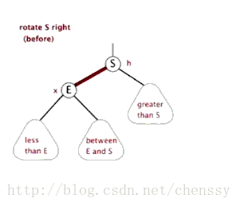
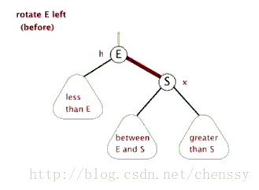

## 面试要点

1. 数据结构
    - HashMap
        - 使用key的hashcode 对 总容量取余后获得位置
            ```
            hash = (h = k.hashCode()) ^ (h >>> 16)
            // 当n是2的指数时, 这个表达式相当于取余操作, 但是效率比取余操作高的多, 所以hashMap的容量必须为2的指数
            i = (n - 1) & hash
            ```
    - ArrayList
    - LinkedList
    - TreeMap(红黑树)
        1. 每个节点只能是红色或者黑色
        2. 根节点永远是黑色的
        3. 所有的叶子的子节点都是空节点，并且都是黑色的
        4. 每个红色节点的两个子节点都是黑色的（不会有两个连续的红色节点）
        5. 从任一个节点到其子树中每个叶子节点的路径都包含相同数量的黑色节点（叶子节点到根节点的黑色节点数量每条路径都相同）
        6. 
        7. 
        ```
        https://my.oschina.net/90888/blog/1626065
        https://blog.csdn.net/cyywxy/article/details/81151104
        ```
    - ConcurrentHashMap
    - 堆
    - 队列
    - 排序
        - 冒泡/选择
        - 堆排序
        - 快速排序
    
2. mysql
    - ACID
        - 原子性（Atomicity）: 整个事务中的所有操作，要么全部完成，要么全部不完成
        - 一致性（Consistency）: 数据库可以按照预想的方式走下去
        - 隔离性（Isolation）: 事务与事务之间互不影响
        - 持久性（Durability）: 事务完成以后, 数据被永久存储
    - sql优化
        ```
        1. 应尽量避免在 where 子句中使用!=或<>操作符，否则将引擎放弃使用索引而进行全表扫描。
        2. 应尽量避免在 where 子句中对字段进行 null 值判断(is null)，否则将导致引擎放弃使用索引而进行全表扫描, 可以规定每个字段必须有默认值
        3. 使用 exists 代替 in 的情况: TODO
        4. 避免在 where 子句中对字段进行表达式, 函数操作, 否则msql会弃用索引
        5. 用or分割开的条件，如果or前的条件中的列有索引，而后面的列中没有索引，那么涉及的索引都不会被用到
        6. 隐式转换导致索引失效
        
        ```
    - 隔离级别
        - 读未提交(read uncommitted): 脏读:可以读取其他事务未提交的脏数据。
        - 读已提交(read committed): 不可重复读: 事务 A 多次读取同一数据，事务 B 在事务A多次读取的过程中，对数据作了更新并提交，导致事务A多次读取同一数据时，结果 不一致。
        - 可重复读(repeatable read): 幻读: 可以读取到别的事务新插入的数据, mysql使用 MVCC：多版本并发控制 后, 已经不会出现幻读了
        ```
        MVCC实现:
        每个数据记录携带两个额外的数据created_by_txn_id和deleted_by_txn_id。
        当一个数据被insert时，created_by_txn_id记录下插入该数据的事务ID，deleted_by_txn_id留空。
        当一个数据被delete时，该数据的deleted_by_txn_id记录执行该删除的事务ID。
        当一个数据被update时，原有数据的deleted_by_txn_id记录执行该更新的事务ID，并且新增一条新的数据记录，其created_by_txn_id记录下更新该数据的事务ID
        在另一个事务进行读取时，由隔离级别来控制到底取哪个版本。同时，在读取过程中，完全不加锁（除非用SELECT … FOR UPDATE强行加锁）
        
        有了MVCC，Read Committed和Repeatable Read就的实现就很直观了：
        对于Read Committed，每次读取时，总是取最新的，被提交的那个版本的数据记录。
        对于Repeatable Read，每次读取时，总是取created_by_txn_id小于等于当前事务ID的那些数据记录。在这个范围内，如果某一数据多个版本都存在，则取最新的。

        作者：大宽宽
        链接：https://www.jianshu.com/p/cb97f76a92fd
        ```
        - 串行(serializable)
    - 主索引, 唯一索引, 倒排索引, 索引在内存? 索引失效?
        - 主索引: innodb唯一的聚簇索引
    - 延迟关联
    - 事务, 实现原理 redo, undo
    - Btree
    - 范式
    - myisam与innodb
        ```
        1.InnoDB支持事物，而MyISAM不支持事物
        2.InnoDB支持行级锁，而MyISAM支持表级锁
        3.InnoDB支持MVCC, 而MyISAM不支持
        4.InnoDB支持外键，而MyISAM不支持
        5.InnoDB不支持全文索引，而MyISAM支持。
        6.InnoDB不能通过直接拷贝表文件的方法拷贝表到另外一台机器， myisam 支持
        7.InnoDB表支持多种行格式， myisam 不支持
        8.InnoDB是索引组织表， myisam 是堆表
        ```
    - 经典sql
    - 反设计模式
    - mysql8的linux安装
        ```
        官方教程:  https://dev.mysql.com/doc/refman/8.0/en/linux-installation-yum-repo.html#yum-repo-installing-mysql
        但是安装完后需要执行  mysqld --initialize   否则找不到初始密码
        ```


3. AQS, 并发框架, 线程池
    - volatile 实现原理
    - synchronize 实现原理
        - 使用对象头中的锁标志位, 并维护一等待队列
        - 偏向锁: 如果无线程竞争, 则仅仅将对象头中的偏向锁标志位改变, 不经过底层, 优化执行效率
        - 轻量级锁: 有冲突时, 变为轻量级锁并启动自旋
        - 重量级锁: 自旋一段时间后依旧无法获得锁, 将对象头的标志位改为重量级锁, 并进入等待队列, 等待被唤醒后进行新一轮抢夺
    - synchronized 与 lock 的区别
    - CAS 乐观锁
    - ABA 问题
    - 乐观锁的业务场景及实现方式
    - CountDownLatch: N个线程执行完countDown()后, 调用await()的线程才能继续执行
    - CyclicBarrier: N个线程都调用了await()后, N个线程才能同时往下执行, 只要有一个线程没调用await(), 调用await()的线程都将被阻塞
    - Semaphore: 限制N个线程进入, 一个线程释放资源后, 另一个线程才能拿到资源在进入
    - CopyOnWriteList: 写时复制, 写很少, 读很多时使用
    - 并发框架
        - LinkedBlockingQueue
        - PriorityBlockingQueue
        - DelayQueue    延迟队列,  基于堆
        - TransferQueue   当有一堆消费者在等待时, 可以不经过队列直接将任务给消费者, 提高效率
        - SynchronousQueue     没有容量, 直接将任务给消费者, 如果没有消费者, add()报错
        


4. JVM, 内存管理
    - 内存溢出怎么办
        1. 修改JVM启动参数，直接增加内存
        2. 检查错误日志，查看“OutOfMemory”错误前是否有其它异常或错误
        3. 内存查看工具动态查看内存使用情况, 确定未及时释放内存的原因
    - 内存模型
        - 程序计数器
        - 堆
            - 新生代, 包括 eden区, 两个survivor区(From, To), 老年代
        - 栈
        - 常量池(也叫方法区, 或永久代, 有的jvm实现和堆在一起)
    - Minor GC: 从年轻代空间（包括 Eden 和 Survivor 区域）回收内存, 一般为 标记-复制算法
    - Full GC: 对老年代的GC  - 一般为 标记-整理算法
    - JVM参数
        - 标准参数: -开头, 稳定, 每个版本几乎一样
        - 非标准化参数: -X开头, 个个版本可能会变, 但变化比较小  -Xint:解释执行. -Xcomp:第一次使用就编译成本地代码  -Xmixed:混合模式, Jvm决定解释执行还是编译执行, 默认
        - 非标准化参数: -XX开头,  
            - 布尔类型: -XX:[+-]<name>: 启用或禁用name参数  -XX:+UserG1GC : 使用G1垃圾收集器
            - 非布尔类型: -XX:<name>=<vale> , -XX:MaxGCPauseMillis=500 GC最长停500毫秒
            - 设置最大内存: -Xmx 等价于 -XX:MaxHeapSize
            - 设置最小内存: -Xms 等价于 -XX:InitialHeapSize
            - 设置线程堆栈大小 -Xss 等价于 -XX:ThreadStackSize   默认1024k, 一般都调成128k
    - JVM调优 
        - 一般步骤: 1. 打开gc日志.  2. 将日志导入可视化工具, 如 GCViewer  3. 分析最大,最小,平均停顿时间以及吞吐量
        - Parallel: 不要设置最大内存, 交给jvm去处理, 可设置吞吐量: -XX:GCTimeRatio=99 99%的时间可用       最大暂停时间: -XX:MaxGCPauseMillis=100  最大停顿100毫秒
        - G1: 
            - 不要显式设置young区和old区大小, 会覆盖暂停时间目标...(待议)
            - G1目标为90%吞吐量, 所以暂停时间不要设置太严苛, 否则影响吞吐量
            - -XX:MetaspaceSize=64m  设置metaspace大小
    - 查看运行时参数: jinfo 命令
        - jinfo -flag <参数名> 进程号    查看当前参数值
        - jinfo -flags 进程号           查看已经被修改过的参数值, 手动修改/tomcat修改等
        - jinfo -flag UseParallelOldGC 26142    查看  UseParallelOldGC 参数
    - 查看jvm统计信息: jstat -<参数名> 进程号
        - -class: 查看类加载信息
        - -compiler: 查看jit编译信息
        - -gc: 垃圾回收信息/内存使用信息
    - 查看java进程 jps
        - jps -l
    - tomcat优化
        - 内存优化 TODO
        - 线程优化
            - maxConnections 最大连接数, nio, nio2下默认10000
            - acceptCount: 超过最大连接, 将加入队列, 默认100
            - maxThreads: 最大工作线程数, 默认200
            - minSpareThread: 最小空闲线程数
        - 配置优化
            - autoDeploy: 周期性得检查有没有新应用要部署, 默认为true, 影响性能应关闭
            - enableLookups: 如果打开, 则调用request.getRemoteHost()时会通过DNS查域名..默认关闭
            - server.xml中的context标签下的 reloadable: 热部署, 默认为false. 影响性能应关闭
            - 使用apr代替nio, http://tomcat.apache.org/tomcat-8.0-doc/apr.html#Linux
            - 禁用session
    - nginx优化
        - 增加工作线程数与并发连接数  
        - 启用长链接
            - http下的keepalive_timeout  客户端与nginx的长连接配置
            - upstream 下的keepalive   配置nginx与服务集群的长连接数量
        - 启用缓存, 压缩
        - 操作系统参数优化
            - sendfile on   减少文件在应用和内核之间的拷贝
            - tcp_nopush on   当数据包达到一定大小再发送
            - tcp_nodelay off  有数据就发  

5. HTTP相关 SpringMVC 流程
    - TODO: SpringMVC 测试

6. Spring AOP, 依赖注入

7. MQ

    消息队列的使用场景
    消息的重发补偿解决思路
    消息的幂等性解决思路（已解答，待补充）
    消息的堆积解决思路
    自己如何实现消息队列
    如何保证消息的有序性


8. 设计模式
    - 单例
    - 命令
    - 装饰者
    - 观察者
    - 工厂模式
    - 代理模式

9. 微服务
你怎么理解 RPC 框架
说说 RPC 的实现原理
你怎么理解 RESTful
说说如何设计一个良好的 API
如何理解 RESTful API 的幂等性
如何保证接口的幂等性
CAP 定理、 BASE 理论
数据一致性问题, 最终一致性的实现方案
你怎么看待微服务


10.redis
    - 锁
    - 缓存
    - 队列


11.linux
    - rpm -qa | grep -i mysql  查看已安装的mysql应用
    - rpm -ev MySQL-devel-5.6.23-1.linux_glibc2.5  rpm卸载


20. 项目相关
    - 打包  半个月熟悉(快速理解熟悉业务, 并能从专业角度切入并给出相应意见), 熟悉过程中
    - 自驱力好, 在项目中独立性好
    - 快速, 高效, 并具有创新意识, 技术壁垒

说说你的开发流程
你和团队是如何沟通的
你如何进行代码评审
说说你对技术与业务的理解
说说你在项目中经常遇到的 Exception
说说你在项目中遇到感觉最难Bug，怎么解决的
说说你在项目中遇到印象最深困难，怎么解决的
你觉得你们项目还有哪些不足的地方
你是否遇到过 CPU 100% ，如何排查与解决
你是否遇到过 内存 OOM ，如何排查与解决


21. 一般烦人问题


说说你的亮点
说说你最近在看什么书
说说你觉得最有意义的技术书籍
说说个人发展方向方面的思考