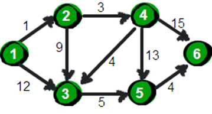
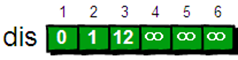
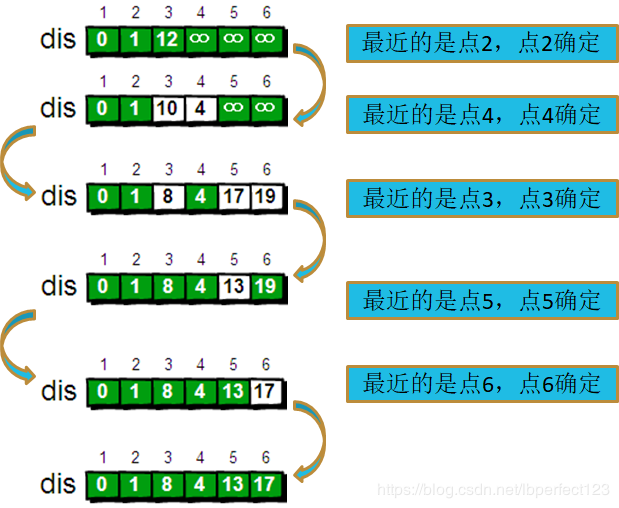

# Dijkstra算法

## 介绍
Dijkstra算法算是贪心思想实现的，先遍历一下还没有在最短路中的点，选出一个距离 已经在最短路集合中的点 距离最近的点，并把它加入到最短路中，并且更新所有点的最短路，直到所有的点都加入到最短路中。

**仅适用于正边权的图**

## 基础思路
指定一个点（源点）到其余各个顶点的最短路径，也叫做“单源最短路径”。例如求下图中的1号顶点到2、3、4、5、6号顶点的最短路径。

问: 如何求1点到剩下路径的最短路径呢?

我们先用一个数据结构存储图的信息

还需要一个一维数组dis来存储1号顶点到其余各顶点的初始路程

以及一个一维数组v来标识节点是否已经被访问

> 变量名：`dis[i]`表示从起始点到节点i的最短路径  `v[i]`表示节点i是否被访问过

下面来模拟下Dijkstra算法的实现过程
- 初始化：所有最短路赋值为`+∞`，并且使`dis[1]=0`，`v[1]=1`，因为任何节点到它本身的距离为0，标记1被访问过。
- 步骤一: 遍历与节点1相连的所有节点，找到距离最近的一个，把这个节点标记为访问过，并更新最短路。因为新加入一条边，可能有很多的最短路会发生改变，所以要更新`所有与最短路径包含的点`相连的点的最短路。由图可知，`12>1`，所以我们把节点2标记为访问过，`v[2]=1`，并且更新最短路`dis[2]=1`。
- 步骤二: 遍历与`最短路包含的点`相连的节点，找到距离最近的。`3<9<12`，所以把节点4加入最短路，并且标记为访问过 `dis[4]=4`,`v[4]=1`。
- 步骤三: 遍历与`最短路包含的点`相连的节点，找到距离最近的。`4<9<12<13<15`，所以把节点3加入最短路，并且标记为访问过 `dis[3]=8`,`v[3]=1`。
- 步骤四: 遍历与`最短路包含的点`相连的节点，找到距离最近的。`5<9<12<13<15`，所以把节点5加入最短路，并且标记为访问过 `dis[5]=13`,`v[5]=1`。
- 步骤五: 遍历与`最短路包含的点`相连的节点，找到距离最近的。`4<9<12<13<15`，所以把节点6加入最短路，并且标记为访问过 `dis[6]=17`,`v[6]=1`。

总结如下图: 

## 堆优化

我们来回顾一下算法的核心部分：先找最小距离，再更新。
在不优化的时候，我们是每次通过循环来寻找最小距离的，这样的话就会有很多不必要的时间浪费掉，所以我们想到了用优先队列优化，因为优先队列会自动按照优先度排序，这样就会省掉寻找最小距离的循环，从而节省一部分时间。

然后我们再想一想优先队列里存放什么东西。我们来看一下不优化之前，在搜索最小距离的时候需要记录的东西——最小距离和节点的编号，所以我们在优先队列里面就放最小距离和节点的编号。
为方便操作，我们就申请一个struct或者pair的优先队列，struct的话就申请两个变量，而pair的话（不了解pair的可以看一下这个博客 https://www.cnblogs.com/lvchaoshun/p/7769003.html），
就在第一个位置里放距离，第二个位置里放id，因为优先队列默认先按照第一关键字排序，我们的目的就是要快速的找到最小距离，所以按照距离排序。优先队列默认从大到小排序，所以我们要使优先队列从小到大排序，或者是在加入新的二元组的时候，把距离变成负的。

## 参考
> https://blog.csdn.net/lbperfect123/article/details/84281300

> https://www.cnblogs.com/Glacier-elk/p/9438077.html