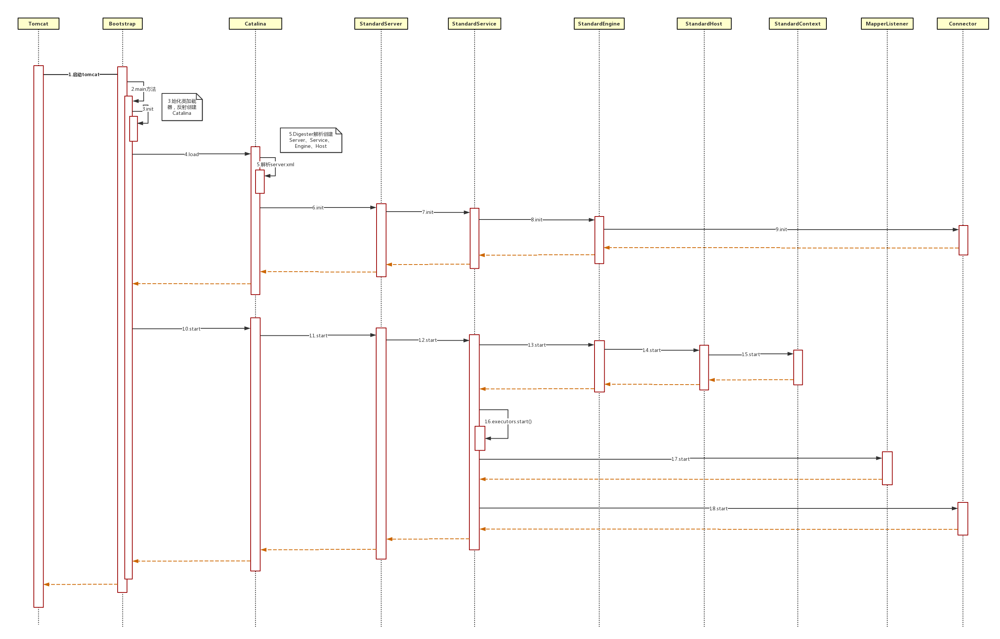
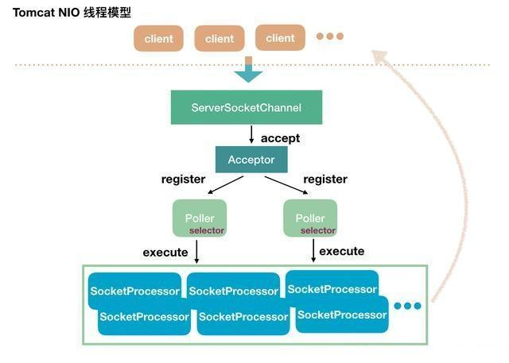

# Tomcat解析

本文对Tomcat的总结是为了更好得理解`SpringMVC`与`Java NIO`, 故不会对Tomcat进行全局分析, 将专注于以下几个点:
- Tomcat如何利用Java NIO
- Tomcat对Servlet的实现
- Tomcat的拦截器, 设计模式
- SpringBoot对Tomcat的整合

先上一张Tomcat启动时序图



## 1. Tomcat的启动阶段

只分析`SpringBoot`是如何启动Tomcat

### 1.1. SpringBoot与Tomcat的整合

SpringBoot与Tomcat的整合最重要的就是要使Tomcat接收的请求, 进入`DispatcherServlet`交给`SpringMVC`处理, 因此, 从`DispatcherServlet`入手

```
// org.springframework.boot.autoconfigure.web.servlet.DispatcherServletAutoConfiguration
@Bean(name = DEFAULT_DISPATCHER_SERVLET_BEAN_NAME)
public DispatcherServlet dispatcherServlet() {
    DispatcherServlet dispatcherServlet = new DispatcherServlet();
    dispatcherServlet.setDispatchOptionsRequest(this.webMvcProperties.isDispatchOptionsRequest());
    dispatcherServlet.setDispatchTraceRequest(this.webMvcProperties.isDispatchTraceRequest());
    dispatcherServlet.setThrowExceptionIfNoHandlerFound(this.webMvcProperties.isThrowExceptionIfNoHandlerFound());
    return dispatcherServlet;
}

@Bean(name = DEFAULT_DISPATCHER_SERVLET_REGISTRATION_BEAN_NAME)
@ConditionalOnBean(value = DispatcherServlet.class, name = DEFAULT_DISPATCHER_SERVLET_BEAN_NAME)
public ServletRegistrationBean<DispatcherServlet> dispatcherServletRegistration(DispatcherServlet dispatcherServlet) {
    ServletRegistrationBean<DispatcherServlet> registration = new ServletRegistrationBean<>(dispatcherServlet, this.serverProperties.getServlet().getServletMapping());
    registration.setName(DEFAULT_DISPATCHER_SERVLET_BEAN_NAME);
    registration.setLoadOnStartup(this.webMvcProperties.getServlet().getLoadOnStartup());
    if (this.multipartConfig != null) {
        registration.setMultipartConfig(this.multipartConfig);
    }
    return registration;
}
```

自动装配(autoconfigure)包中, 自动注册了`DispatcherServlet`及`ServletRegistrationBean`, 并且把`DispatcherServlet`放入了`ServletRegistrationBean`.

而`ServletRegistrationBean`是`ServletContextInitializer`的实现类,  因此启动时会调用其`onStartup()`方法, 那么就产生了几个问题:

- `ServletRegistrationBean#onStartup()`是何时调用的
- `onStartup()`里是如何注册`DispatcherServlet`
- `ServletRegistrationBean`必然有注册才能调用, 那么是何时注册的
- 这逻辑的入口在哪里

### 1.2. AbstractApplicationContext#onRefresh()

一切从我们熟悉的`AbstractApplicationContext#onRefresh()`方法说起, 当应用类型是Web时, SpringBoot默认帮我们实例化的`ApplicationContext`是`AnnotationConfigServletWebServerApplicationContext`, 其是`ServletWebServerApplicationContext`的子类.
 
而`ServletWebServerApplicationContext`重写了`onRefresh()`方法, 其中启动了Tomcat:
```
protected void onRefresh() {
    super.onRefresh();
    try {
        createWebServer();
    } catch (Throwable ex) {
        throw new ApplicationContextException("Unable to start web server", ex);
    }
}
private void createWebServer() {
    WebServer webServer = this.webServer;
    ServletContext servletContext = getServletContext();
    if (webServer == null && servletContext == null) {
        ServletWebServerFactory factory = getWebServerFactory();
        // 重点, 这里初始化并启动了Tomecat
        // 这个getSelfInitializer()非常重要
        this.webServer = factory.getWebServer(getSelfInitializer());
    } else if (servletContext != null) {
        try {
            getSelfInitializer().onStartup(servletContext);
        } catch (ServletException ex) {
            throw new ApplicationContextException("Cannot initialize servlet context", ex);
        }
    }
    initPropertySources();
}
// 这里返回了一个内部类ServletContextInitializer, 其onStartup()方法会直接调用下面的selfInitialize(), 
private org.springframework.boot.web.servlet.ServletContextInitializer getSelfInitializer() {
    return this::selfInitialize;
}
private void selfInitialize(ServletContext servletContext) throws ServletException {
    prepareWebApplicationContext(servletContext);
    ConfigurableListableBeanFactory beanFactory = getBeanFactory();
    ExistingWebApplicationScopes existingScopes = new ExistingWebApplicationScopes(beanFactory);
    WebApplicationContextUtils.registerWebApplicationScopes(beanFactory, getServletContext());
    existingScopes.restore();
    WebApplicationContextUtils.registerEnvironmentBeans(beanFactory, getServletContext());
    // 拿到已注册的ServletContextInitializer, 调用onStartup(), 而ServletRegistrationBean就是在这里被调用的
    for (ServletContextInitializer beans : getServletContextInitializerBeans()) {
        beans.onStartup(servletContext);
    }
}
```

这里是传入了一个内部`ServletContextInitializer`, 我们先分析`factory.getWebServer()`, 后面会调用其方法的时候在分析`selfInitialize()`

```
public WebServer getWebServer(ServletContextInitializer... initializers) {
    // 创建了Tomcat服务器
    Tomcat tomcat = new Tomcat();
    // 下面代码创建了Tomcat的连接器, 服务等等组件
    File baseDir = (this.baseDirectory != null ? this.baseDirectory : createTempDir("tomcat"));
    tomcat.setBaseDir(baseDir.getAbsolutePath());
    Connector connector = new Connector(this.protocol);
    tomcat.getService().addConnector(connector);
    customizeConnector(connector);
    tomcat.setConnector(connector);
    tomcat.getHost().setAutoDeploy(false);
    configureEngine(tomcat.getEngine());
    for (Connector additionalConnector : this.additionalTomcatConnectors) {
        tomcat.getService().addConnector(additionalConnector);
    }
    // 重点: 实例化了Context并对ServletContextInitializer的处理
    prepareContext(tomcat.getHost(), initializers);
    // 把Tomcat服务器封装为TomcatWebServer返回
    return getTomcatWebServer(tomcat);
}
protected void prepareContext(Host host, ServletContextInitializer[] initializers) {
    File documentRoot = getValidDocumentRoot();
    // 实际实例化的是 TomcatEmbeddedContext, 其继承了 StandardContext
    TomcatEmbeddedContext context = new TomcatEmbeddedContext();
    // 下面都是对StandardContext的初始化, 就不分析了
    if (documentRoot != null) {
        context.setResources(new LoaderHidingResourceRoot(context));
    }
    context.setName(getContextPath());
    context.setDisplayName(getDisplayName());
    context.setPath(getContextPath());
    File docBase = (documentRoot != null ? documentRoot
            : createTempDir("tomcat-docbase"));
    context.setDocBase(docBase.getAbsolutePath());
    context.addLifecycleListener(new FixContextListener());
    context.setParentClassLoader(
            this.resourceLoader != null ? this.resourceLoader.getClassLoader()
                    : ClassUtils.getDefaultClassLoader());
    resetDefaultLocaleMapping(context);
    addLocaleMappings(context);
    context.setUseRelativeRedirects(false);
    configureTldSkipPatterns(context);
    WebappLoader loader = new WebappLoader(context.getParentClassLoader());
    loader.setLoaderClass(TomcatEmbeddedWebappClassLoader.class.getName());
    loader.setDelegate(true);
    context.setLoader(loader);
    if (isRegisterDefaultServlet()) {
        addDefaultServlet(context);
    }
    if (shouldRegisterJspServlet()) {
        addJspServlet(context);
        addJasperInitializer(context);
    }
    context.addLifecycleListener(new StaticResourceConfigurer(context));
    ServletContextInitializer[] initializersToUse = mergeInitializers(initializers);
    // 将StandardContext放在 Host下
    host.addChild(context);
    // 重点: StandardContext 封装ServletContextInitializer
    configureContext(context, initializersToUse);
    postProcessContext(context);
}
protected void configureContext(Context context,
        ServletContextInitializer[] initializers) {
    // 将 ServletContextInitializer 封装进 TomcatStarter
    // 其实这个TomcatStarter 就是为了集中处理 ServletContextInitializer
    TomcatStarter starter = new TomcatStarter(initializers);
    if (context instanceof TomcatEmbeddedContext) {
        // Should be true
        ((TomcatEmbeddedContext) context).setStarter(starter);
    }
    // 重点: 将 TomcatStarter 放入 StandardContext
    context.addServletContainerInitializer(starter, NO_CLASSES);
    // 这里初始化了监听器
    for (LifecycleListener lifecycleListener : this.contextLifecycleListeners) {
        context.addLifecycleListener(lifecycleListener);
    }
    // 继续初始化 StandardContext , 就不分析了
    for (Valve valve : this.contextValves) {
        context.getPipeline().addValve(valve);
    }
    for (ErrorPage errorPage : getErrorPages()) {
        new TomcatErrorPage(errorPage).addToContext(context);
    }
    for (MimeMappings.Mapping mapping : getMimeMappings()) {
        context.addMimeMapping(mapping.getExtension(), mapping.getMimeType());
    }
    configureSession(context);
    // 对StandardContext进行自定义操作
    for (TomcatContextCustomizer customizer : this.tomcatContextCustomizers) {
        customizer.customize(context);
    }
}

private Map<ServletContainerInitializer,Set<Class<?>>> initializers = new LinkedHashMap<>();
public void addServletContainerInitializer( ServletContainerInitializer sci, Set<Class<?>> classes) {
    // 直接放入 initializers 成员变量中
    initializers.put(sci, classes);
}
```

到现在层次有点多, 但是我们只需要知道`ServletContainerInitializer`实际上是放在了`StandardContext`的`initializers`成员变量中
```
    private Map<ServletContainerInitializer,Set<Class<?>>> initializers = new LinkedHashMap<>();
```
而其中只有一个值, 就是`TomcatStarter`, 而`TomcatStarter`自身也实现了`ServletContainerInitializer`, 并且本身就是一个`ServletContainerInitializer`集合

我们继续收集完`ServletContainerInitializer`, 我们看看其是怎么执行`onStartUp()`方法的

```
// org.springframework.boot.web.embedded.tomcat.TomcatServletWebServerFactory.getTomcatWebServer
protected TomcatWebServer getTomcatWebServer(Tomcat tomcat) {
    // 封装Tomcat服务器的方法, 我们看看其构造方法
    return new TomcatWebServer(tomcat, getPort() >= 0);
}
public TomcatWebServer(Tomcat tomcat, boolean autoStart) {
    Assert.notNull(tomcat, "Tomcat Server must not be null");
    this.tomcat = tomcat;
    this.autoStart = autoStart;
    // 重点, 初始化
    initialize();
}
private void initialize() throws WebServerException {
    synchronized (this.monitor) {
        try {
            addInstanceIdToEngineName();
            Context context = findContext();
            // 重点: 添加生命周期监听器, 移除 Connectors, 这个后面再说
            context.addLifecycleListener((event) -> {
                if (context.equals(event.getSource()) && Lifecycle.START_EVENT.equals(event.getType())) {
                    removeServiceConnectors();
                }
            });
            // Start the server to trigger initialization listeners
            // tomcat启动方法, 会引发一连串的start()方法的调用
            this.tomcat.start();

            // We can re-throw failure exception directly in the main thread
            rethrowDeferredStartupExceptions();
            try {
                ContextBindings.bindClassLoader(context, context.getNamingToken(), getClass().getClassLoader());
            } catch (NamingException ex) {
            }
            startDaemonAwaitThread();
        } catch (Exception ex) {
            stopSilently();
            throw new WebServerException("Unable to start embedded Tomcat", ex);
        }
    }
}
```
我们看到`TomcatWebServer#initialize()`中调用了`Tomcat#start()`方法启动Tomcat服务, 根据上面的`Tomcat`时序图, 可以看到其最终会调用`StandardContext#start()`, 所以我们直接跳到此方法.

```
// StandardContext#startInternal() 长达近300行代码, 我们只看我们关心的部分:
protected synchronized void startInternal() throws LifecycleException {
    // 省略代码
    // Call ServletContainerInitializers
    for (Map.Entry<ServletContainerInitializer, Set<Class<?>>> entry :
        initializers.entrySet()) {
        try {
            // 这里的key就是 TomcatStarter
            entry.getKey().onStartup(entry.getValue(), getServletContext());
        } catch (ServletException e) {
            log.error(sm.getString("standardContext.sciFail"), e);
            ok = false;
            break;
        }
    }
    // 省略代码
}
// TomcatStarter.onStartup()
public void onStartup(Set<Class<?>> classes, ServletContext servletContext) throws ServletException {
    try {
        for (ServletContextInitializer initializer : this.initializers) {
            initializer.onStartup(servletContext);
        }
    } catch (Exception ex) {
        this.startUpException = ex;
        logger.error("Error starting Tomcat context. Exception: " + ex.getClass().getName() + ". Message: " + ex.getMessage());
    }
}
// 终于, 在这里执行了ServletWebServerApplicationContext的内部类 ServletContainerInitializer, 我再贴一遍代码
private void selfInitialize(ServletContext servletContext) throws ServletException {
    prepareWebApplicationContext(servletContext);
    ConfigurableListableBeanFactory beanFactory = getBeanFactory();
    ExistingWebApplicationScopes existingScopes = new ExistingWebApplicationScopes(beanFactory);
    WebApplicationContextUtils.registerWebApplicationScopes(beanFactory, getServletContext());
    existingScopes.restore();
    WebApplicationContextUtils.registerEnvironmentBeans(beanFactory, getServletContext());
    // 重点: 获得BeanFactory中的ServletContextInitializer并执行onStartup()
    for (ServletContextInitializer beans : getServletContextInitializerBeans()) {
        beans.onStartup(servletContext);
    }
}
protected Collection<ServletContextInitializer> getServletContextInitializerBeans() {
    return new ServletContextInitializerBeans(getBeanFactory());
}
```

注意: ServletContextInitializerBeans是一个 Collection, 所以可以直接使用迭代器迭代ServletContainerInitializer, 所以我们看其构造方法
```
// key是 ServletContextInitializer.class及其子类
private final MultiValueMap<Class<?>, ServletContextInitializer> initializers;
// 最终迭代这个变量
private List<ServletContextInitializer> sortedList;
public ServletContextInitializerBeans(ListableBeanFactory beanFactory) {
    this.initializers = new LinkedMultiValueMap<>();
    // 获得ServletContextInitializer
    addServletContextInitializerBeans(beanFactory);
    addAdaptableBeans(beanFactory);
    List<ServletContextInitializer> sortedInitializers = new ArrayList<>();
    this.initializers.values().forEach((contextInitializers) -> {
        AnnotationAwareOrderComparator.sort(contextInitializers);
        sortedInitializers.addAll(contextInitializers);
    });
    // 将ServletContextInitializer赋值给sortedList, 等待遍历
    this.sortedList = Collections.unmodifiableList(sortedInitializers);
}
```

至此, SpringBoot帮我们注册的`ServletRegistrationBean`的`onStartup()`方法终于被调用

### 1.3. ServletRegistrationBean#onStartup()

剩下的就相对比较简单了, 就是往 里加Servlet就可以了

```
public final void onStartup(ServletContext servletContext) throws ServletException {
    // 实际值为 "servlet dispatcherServlet"
    String description = getDescription();
    if (!isEnabled()) {
        logger.info(StringUtils.capitalize(description) + " was not registered (disabled)");
        return;
    }
    // 注册..
    register(description, servletContext);
}
protected final void register(String description, ServletContext servletContext) {
    // 重点 
    D registration = addRegistration(description, servletContext);
    if (registration == null) {
        logger.info(StringUtils.capitalize(description) + " was not registered " + "(possibly already registered?)");
        return;
    }
    configure(registration);
}
protected ServletRegistration.Dynamic addRegistration(String description, ServletContext servletContext) {
    // 实际值为 dispatcherServlet
    String name = getServletName();
    // Servlet dispatcherServlet mapped to [/]
    logger.info("Servlet " + name + " mapped to " + this.urlMappings);
    // 将DispatcherServlet放入ServletContext
    return servletContext.addServlet(name, this.servlet);
}
```

加入`ServletContext`还有些逻辑:
```
private ServletRegistration.Dynamic addServlet(String servletName, String servletClass, Servlet servlet, Map<String,String> initParams) throws IllegalStateException {

    if (servletName == null || servletName.equals("")) {
        throw new IllegalArgumentException(sm.getString("applicationContext.invalidServletName", servletName));
    }

    if (!context.getState().equals(LifecycleState.STARTING_PREP)) {
        //TODO Spec breaking enhancement to ignore this restriction
        throw new IllegalStateException(sm.getString("applicationContext.addServlet.ise", getContextPath()));
    }

    // 实现类为 StandardWrapper, 缓存机制
    Wrapper wrapper = (Wrapper) context.findChild(servletName);
    if (wrapper == null) {
        wrapper = context.createWrapper();
        wrapper.setName(servletName);
        context.addChild(wrapper);
    } else {
        if (wrapper.getName() != null && wrapper.getServletClass() != null) {
            if (wrapper.isOverridable()) {
                wrapper.setOverridable(false);
            } else {
                return null;
            }
        }
    }

    ServletSecurity annotation = null;
    if (servlet == null) {
        wrapper.setServletClass(servletClass);
        Class<?> clazz = Introspection.loadClass(context, servletClass);
        if (clazz != null) {
            annotation = clazz.getAnnotation(ServletSecurity.class);
        }
    } else {
        // 将servlet加入 StandardWrapper
        wrapper.setServletClass(servlet.getClass().getName());
        wrapper.setServlet(servlet);
        if (context.wasCreatedDynamicServlet(servlet)) {
            annotation = servlet.getClass().getAnnotation(ServletSecurity.class);
        }
    }

    if (initParams != null) {
        for (Map.Entry<String, String> initParam: initParams.entrySet()) {
            wrapper.addInitParameter(initParam.getKey(), initParam.getValue());
        }
    }

    ServletRegistration.Dynamic registration = new ApplicationServletRegistration(wrapper, context);
    if (annotation != null) {
        registration.setServletSecurity(new ServletSecurityElement(annotation));
    }
    return registration;
}
```

这里可以看出来, 一个 StandardContext 对应多个 StandardWrapper, 一个StandardWrapper对应一个Servlet

至此, 我们已经把`DispatherServlet`注册进`Wrapper`, 且`Wrapper`已经被`StandardContext`的`children`成员变量所引用, 具备了在`Tomcat`运行中被调用的可能.

## 2. Tomcat Connection的启动

按Tomcat的启动时序图来说, 经过上面的代码, Tomcat就已经启动了, 即Tomcat已经监听端口了, 但是, SpringBoot对Tomcat的启动做了一个小修改, 此时的Tomcat的容器虽然都初始化了, 但是Connection却还没有初始化.

在`TomcatWebServer#initialize()`方法中: 有这样的一段代码:
```
context.addLifecycleListener((event) -> {
    if (context.equals(event.getSource()) && Lifecycle.START_EVENT.equals(event.getType())) {
        removeServiceConnectors();
    }
});
```

它注册了一个`LifecycleListener`, 并在里面调用了`removeServiceConnectors()`这个方法
```
private void removeServiceConnectors() {
    for (Service service : this.tomcat.getServer().findServices()) {
        Connector[] connectors = service.findConnectors().clone();
        this.serviceConnectors.put(service, connectors);
        for (Connector connector : connectors) {
            service.removeConnector(connector);
        }
    }
}
```
它将`Connector`暂存在`serviceConnectors`这个变量里, 并移除可各个`Service`的`Connector`

它会在`StandardContext#startInternal()`中执行

SoringBoot为什么这么做? 可以猜测是因为初始化`Connector`可能依赖Spring容器 TODO

### 2.1. ServletWebServerApplicationContext.finishRefresh
`Connection`实际上是在`ServletWebServerApplicationContext.finishRefresh()`方法中启动的

```
// ServletWebServerApplicationContext#finishRefresh()
protected void finishRefresh() {
    super.finishRefresh();
    // 重点启动Tomcat
    WebServer webServer = startWebServer();
    // 这里使用了ApplicationContext的事件发布功能
    // ??? 这个事件的作用?
    if (webServer != null) {
        publishEvent(new ServletWebServerInitializedEvent(webServer, this));
    }
}

public void start() throws WebServerException {
    synchronized (this.monitor) {
        if (this.started) {
            return;
        }
        try {
            // 把Connection放回Service中, 并清空serviceConnectors变量, 总之, 就是还原到LifecycleListener调用之前的状态
            // 重点: 这里会监听端口
            addPreviouslyRemovedConnectors();
            // 获得上一行代码还原的Connector
            Connector connector = this.tomcat.getConnector();
            if (connector != null && this.autoStart) {
                // 这里调用流程很长, 但是实际上就是对loadOnStartup这个参数的实现, 最终调用 StandardWrapper#load()
                startConnector();
            }
            checkThatConnectorsHaveStarted();
            this.started = true;
            TomcatWebServer.logger.info("Tomcat started on port(s): " + getPortsDescription(true) + " with context path '" + getContextPath() + "'");
        } catch (ConnectorStartFailedException ex) {
            stopSilently();
            throw ex;
        } catch (Exception ex) {
            throw new WebServerException("Unable to start embedded Tomcat server", ex);
        }
        finally {
            Context context = findContext();
            ContextBindings.unbindClassLoader(context, context.getNamingToken(), getClass().getClassLoader());
        }
    }
}
private void addPreviouslyRemovedConnectors() {
    Service[] services = this.tomcat.getServer().findServices();
    for (Service service : services) {
        Connector[] connectors = this.serviceConnectors.get(service);
        if (connectors != null) {
            for (Connector connector : connectors) {
                // 重点:
                service.addConnector(connector);
                if (!this.autoStart) {
                    stopProtocolHandler(connector);
                }
            }
            this.serviceConnectors.remove(service);
        }
    }
}
```

`addPreviouslyRemovedConnectors()`看似只是个还原操作, 实际上逻辑逗藏在`service.addConnector(connector);`这行代码里
```
public void addConnector(Connector connector) {
    synchronized (connectorsLock) {
        connector.setService(this);
        Connector results[] = new Connector[connectors.length + 1];
        System.arraycopy(connectors, 0, results, 0, connectors.length);
        results[connectors.length] = connector;
        connectors = results;
        if (getState().isAvailable()) {
            try {
                // 重点: 启动Connector
                connector.start();
            } catch (LifecycleException e) {
                log.error(sm.getString("standardService.connector.startFailed", connector), e);
            }
        }

        // Report this property change to interested listeners
        support.firePropertyChange("connector", null, connector);
    }

}
```

这里`connector.start();`的调用链又很长, 它会依次调用:
- `Connector#startInternal()`
- `AbstractProtocol#start()`
- `AbstractEndpoint#start()`

### 2.2. AbstractEndpoint#start

我们只关注`AbstractEndpoint#start()`方法, 因为它和`Java NIO`相关

`NioEndPoint`是Tomcat对使用Java NIO来接受请求的实现类

要理解tomcat的nio最主要就是对NioEndpoint的理解。它一共包含`LimitLatch`、`Acceptor`、`Poller`、`SocketProcessor`、`Executor`5个部分。

- `LimitLatch`是连接控制器，它负责维护连接数的计算，nio模式下默认是10000，达到这个阈值后，就会拒绝连接请求。
- `Acceptor`负责接收连接，默认是1个线程来执行，将请求的事件注册到事件列表。
- `Poller`来负责轮询，`Poller`线程数量是cpu的核数`Math.min(2,Runtime.getRuntime().availableProcessors())`。由Poller将就绪的事件生成`SocketProcessor`同时交给`Executor`去执行。
- `Executor`线程池的大小就是我们在Connector节点配置的maxThreads的值。在`Executor`的线程中，会完成从socket中读取http request，解析成`HttpServletRequest`对象，分派到相应的servlet并完成逻辑，然后将response通过socket发回client。

继续看代码:
```
org.apache.tomcat.util.net.AbstractEndpoint#start
public final void start() throws Exception {
    if (bindState == BindState.UNBOUND) {
        // 如果没绑定端口,则绑定端口
        bind();
        bindState = BindState.BOUND_ON_START;
    }
    // 初始化Endpoint
    startInternal();
}
```

打开服务器通道, 绑定端口, 打开选择器:
```
private ServerSocketChannel serverSock = null;
// ???
protected SocketProperties socketProperties = new SocketProperties();
// Acceptor线程数
protected int acceptorThreadCount = 1;
// Poller线程数
private int pollerThreadCount = Math.min(2,Runtime.getRuntime().availableProcessors());
// 这个类封装了Selector
private NioSelectorPool selectorPool = new NioSelectorPool();
public void bind() throws Exception {
    // 这里很面熟吧?
    serverSock = ServerSocketChannel.open();
    socketProperties.setProperties(serverSock.socket());
    InetSocketAddress addr = (getAddress()!=null?new InetSocketAddress(getAddress(),getPort()):new InetSocketAddress(getPort()));
    serverSock.socket().bind(addr,getAcceptCount());
    // 默认是阻塞
    serverSock.configureBlocking(true); //mimic APR behavior

    if (acceptorThreadCount == 0) {
        acceptorThreadCount = 1;
    }
    if (pollerThreadCount <= 0) {
        pollerThreadCount = 1;
    }
    setStopLatch(new CountDownLatch(pollerThreadCount));
    // Initialize SSL if needed
    initialiseSsl();
    // 重点 这里调用了Selector.open()
    selectorPool.open();
}

protected static final boolean SHARED = Boolean.parseBoolean(System.getProperty("org.apache.tomcat.util.net.NioSelectorShared", "true"));
public void open() throws IOException {
    enabled = true;
    // 重点
    getSharedSelector();
    // 默认是true
    if (SHARED) {
        // ???
        blockingSelector = new NioBlockingSelector();
        blockingSelector.open(getSharedSelector());
    }

}

protected volatile Selector SHARED_SELECTOR;
protected Selector getSharedSelector() throws IOException {
    // 又见双重锁定
    if (SHARED && SHARED_SELECTOR == null) {
        synchronized ( NioSelectorPool.class ) {
            if ( SHARED_SELECTOR == null )  {
                // 开启selector
                SHARED_SELECTOR = Selector.open();
            }
        }
    }
    return  SHARED_SELECTOR;
}
```

初始化`NioEndPoint`
```
public void startInternal() throws Exception {
    if (!running) {
        // 如果没启动, 则设置为启动状态
        running = true;
        paused = false;
        // TODO: 这三缓存是?
        processorCache = new SynchronizedStack<>(SynchronizedStack.DEFAULT_SIZE, socketProperties.getProcessorCache());
        eventCache = new SynchronizedStack<>(SynchronizedStack.DEFAULT_SIZE, socketProperties.getEventCache());
        nioChannels = new SynchronizedStack<>(SynchronizedStack.DEFAULT_SIZE, socketProperties.getBufferPool());

        // 初始化线程池, 线程数默认10-200
        if ( getExecutor() == null ) {
            createExecutor();
        }
        // 创建并发连接数控制器
        initializeConnectionLatch();

        // 初始化Poller, 默认2个
        pollers = new Poller[getPollerThreadCount()];
        for (int i=0; i<pollers.length; i++) {
            pollers[i] = new Poller();
            Thread pollerThread = new Thread(pollers[i], getName() + "-ClientPoller-"+i);
            pollerThread.setPriority(threadPriority);
            pollerThread.setDaemon(true);
            pollerThread.start();
        }
        // 初始化接收线程, 默认1个
        startAcceptorThreads();
    }
}
protected LimitLatch initializeConnectionLatch() {
    // maxConnections 最大连接数默认10000
    if (maxConnections==-1) return null;
    if (connectionLimitLatch==null) {
        connectionLimitLatch = new LimitLatch(getMaxConnections());
    }
    return connectionLimitLatch;
}
```
到这里，我们启动了工作线程池、 poller 线程组、acceptor 线程组。同时，工作线程池初始就已经启动了 10 个线程。

`Tomcat`启动时候的关注的点都已经探索完毕, 那么还剩余的就是Tomcat运行时逻辑, 继续第二部分源码探索

## 3. Tomcat运行阶段

在从socket中读数据和往socket中写数据的过程，并没有像典型的非阻塞的NIO的那样，注册OP_READ或OP_WRITE事件到主Selector，而是直接通过socket完成读写，这时是阻塞完成的，但是在timeout控制上，使用了NIO的Selector机制，但是这个Selector并不是Poller线程维护的主Selector，而是BlockPoller线程中维护的Selector，称之为辅Selector。

Tomcat NIO线程模型



下面通过源码来深入理解上图中的内容

### 3.1. NioEndPoint.Acceptor.run

这是一切请求进入Java代码最初始的地方

启动`Acceptor`线程后, 重点看下如何接受新请求
```
// true为暂停
protected volatile boolean paused = false;
// Acceptor状态枚举
public enum AcceptorState {
    NEW, RUNNING, PAUSED, ENDED
}
// 默认为新建状态
protected volatile AcceptorState state = AcceptorState.NEW;
private String threadName;
public void run() {
    int errorDelay = 0;
    // Loop until we receive a shutdown command
    while (running) {
        // 如果 endpoint 处于 pause 状态，这边 Acceptor 用一个 while 循环将自己也挂起
        while (paused && running) {
            state = AcceptorState.PAUSED;
            Thread.sleep(50);
        }
        // endpoint 结束，Acceptor 也结束
        if (!running) {
            break;
        }
        state = AcceptorState.RUNNING;

        // 检查当前连接数, 如果大于最大连接, wait
        countUpOrAwaitConnection();

        SocketChannel socket = null;
        try {
            // 接收新连接, 这里是阻塞的
            socket = serverSock.accept();
        } catch (IOException ioe) {
            // 报错, 减少连接数
            countDownConnection();
            if (running) {
                // Introduce delay if necessary
                errorDelay = handleExceptionWithDelay(errorDelay);
                // re-throw
                throw ioe;
            } else {
                break;
            }
        }
        // accept 成功，将 errorDelay 设置为 0
        errorDelay = 0;

        // Configure the socket
        if (running && !paused) {
            // setSocketOptions() will hand the socket off to an appropriate processor if successful
            // 重点, 接受到新连接后,注册到轮询线程
            if (!setSocketOptions(socket)) {
                closeSocket(socket);
            }
        } else {
            closeSocket(socket);
        }
    }
    state = AcceptorState.ENDED;
}
protected boolean setSocketOptions(SocketChannel socket) {
    // Process the connection
    try {
        //将连接通道设置为非阻塞
        socket.configureBlocking(false);
        // 缓存socket????
        Socket sock = socket.socket();
        socketProperties.setProperties(sock);

        // 使用NioChannel封装SocketChannel
        NioChannel channel = nioChannels.pop();
        if (channel == null) {
            SocketBufferHandler bufhandler = new SocketBufferHandler(socketProperties.getAppReadBufSize(), socketProperties.getAppWriteBufSize(), socketProperties.getDirectBuffer());
            if (isSSLEnabled()) {
                channel = new SecureNioChannel(socket, bufhandler, selectorPool, this);
            } else {
                channel = new NioChannel(socket, bufhandler);
            }
        } else {
            channel.setIOChannel(socket);
            channel.reset();
        }
        // 重点 获得Poller并调用register()方法
        getPoller0().register(channel);
    } catch (Throwable t) {
        ExceptionUtils.handleThrowable(t);
        // Tell to close the socket
        return false;
    }
    return true;
}
```
可以看出来, Acceptor就是用来接收新连接, 并且调用`Poller`的`register()`方法, 把新连接交给`Poller`处理, 之后就继续下一个循环

我们只需要明白，此时，往 `Poller` 中注册了一个`NioChannel`实例，此实例包含客户端过来的 `SocketChannel` 和一个 `SocketBufferHandler` 实例。

```
// org.apache.tomcat.util.net.NioEndpoint.Poller#register
public void register(final NioChannel socket) {
    socket.setPoller(this);
    NioSocketWrapper ka = new NioSocketWrapper(socket, NioEndpoint.this);
    socket.setSocketWrapper(ka);
    ka.setPoller(this);
    ka.setReadTimeout(getSocketProperties().getSoTimeout());
    ka.setWriteTimeout(getSocketProperties().getSoTimeout());
    ka.setKeepAliveLeft(NioEndpoint.this.getMaxKeepAliveRequests());
    ka.setSecure(isSSLEnabled());
    ka.setReadTimeout(getConnectionTimeout());
    ka.setWriteTimeout(getConnectionTimeout());
    // 构造PollerEvent，并添加到事件队列
    PollerEvent r = eventCache.pop();
    ka.interestOps(SelectionKey.OP_READ);//this is what OP_REGISTER turns into.
    // 注意, 这里创建的时候使用的是OP_REGISTER, 对应操作是注册到selector
    if ( r==null) r = new PollerEvent(socket,ka,OP_REGISTER);
    else r.reset(socket,ka,OP_REGISTER);
    addEvent(r);
}
private void addEvent(PollerEvent event) {
    events.offer(event);
    if ( wakeupCounter.incrementAndGet() == 0 ) selector.wakeup();
}
```

明显这里使用的是生产/消费模式发送了接收新连接的事件, 那么接下来就是要看那里消费了这个事件

```
// eventCache 队列缓存，此类的核心
private SynchronizedStack<PollerEvent> eventCache;

private AtomicLong wakeupCounter = new AtomicLong(0);
private volatile int keyCount = 0;
public void run() {
    while (true) {
        // 是否有事件
        boolean hasEvents = false;

        try {
            if (!close) {
                // 重点, 检查是否有事件, 在这里把新连接的socketChannel注册到Selector
                hasEvents = events();
                // 注册完socketChannel就调用select阻塞, 知道有数据到达
                // wakeupCounter 的初始值为 0，这里设置为 -1
                if (wakeupCounter.getAndSet(-1) > 0) {
                    //if we are here, means we have other stuff to do  do a non blocking select
                    keyCount = selector.selectNow();
                } else {
                    // 默认1秒超时
                    keyCount = selector.select(selectorTimeout);
                }
                wakeupCounter.set(0);
            }
            if (close) {
                events();
                timeout(0, false);
                try {
                    selector.close();
                } catch (IOException ioe) {
                    log.error(sm.getString("endpoint.nio.selectorCloseFail"), ioe);
                }
                break;
            }
        } catch (Throwable x) {
            ExceptionUtils.handleThrowable(x);
            log.error("",x);
            continue;
        }
        // 在处理数据前, 在查看下有没有新连接要注册
        if ( keyCount == 0 ) hasEvents = (hasEvents | events());

        Iterator<SelectionKey> iterator = keyCount > 0 ? selector.selectedKeys().iterator() : null;
        while (iterator != null && iterator.hasNext()) {
            SelectionKey sk = iterator.next();
            NioSocketWrapper attachment = (NioSocketWrapper)sk.attachment();
            // Attachment may be null if another thread has called cancelledKey()
            if (attachment == null) {
                iterator.remove();
            } else {
                iterator.remove();
                // 重点, 处理数据
                processKey(sk, attachment);
            }
        }
        //process timeouts
        timeout(keyCount,hasEvents);
    }
    getStopLatch().countDown();
}

public boolean events() {
    boolean result = false;
    PollerEvent pe = null;
    // events.poll()会拉取一个上面插入的PollerEvent
    for (int i = 0, size = events.size(); i < size && (pe = events.poll()) != null; i++ ) {
        result = true;
        try {
            // 重点, 这里是直接调用run方法
            pe.run();
            pe.reset();
            if (running && !paused) {
                eventCache.push(pe);
            }
        } catch ( Throwable x ) {
            log.error("",x);
        }
    }
    return result;
}
public void run() {
    if (interestOps == OP_REGISTER) {
        // 终于, 在这里把新连接的socketChannel注册到Selector
        // 将 socketWrapper 设置为 attachment 进行传递 这个对象里啥都有
        socket.getIOChannel().register(socket.getPoller().getSelector(), SelectionKey.OP_READ, socketWrapper);
    } else {
        // TODO: 这个else 是干嘛
        final SelectionKey key = socket.getIOChannel().keyFor(socket.getPoller().getSelector());
        try {
            if (key == null) {
                // The key was cancelled (e.g. due to socket closure)
                // and removed from the selector while it was being
                // processed. Count down the connections at this point
                // since it won't have been counted down when the socket
                // closed.
                socket.socketWrapper.getEndpoint().countDownConnection();
            } else {
                final NioSocketWrapper socketWrapper = (NioSocketWrapper) key.attachment();
                if (socketWrapper != null) {
                    //we are registering the key to start with, reset the fairness counter.
                    int ops = key.interestOps() | interestOps;
                    socketWrapper.interestOps(ops);
                    key.interestOps(ops);
                } else {
                    socket.getPoller().cancelledKey(key);
                }
            }
        } catch (CancelledKeyException ckx) {
            try {
                socket.getPoller().cancelledKey(key);
            } catch (Exception ignore) {}
        }
    }
}
```

到这里，我们再回顾一下：刚刚在 `PollerEvent#run()`方法中，我们看到，新的 `SocketChannel` 注册到了 `Poller` 内部的 `Selector` 中，监听 `OP_READ` 事件，然后我们再回到 `Poller#run()` 看下，一旦该 `SocketChannel` 是 `readable` 的状态，那么就会进入到 `poller` 的 `processKey` 方法。

```
protected void processKey(SelectionKey sk, NioSocketWrapper attachment) {
    try {
        if ( close ) {
            cancelledKey(sk);
        } else if ( sk.isValid() && attachment != null ) {
            if (sk.isReadable() || sk.isWritable() ) {
                if ( attachment.getSendfileData() != null ) {
                    // TODO: Sendfile 是啥?
                    processSendfile(sk,attachment, false);
                } else {
                    // 如接下来是处理 SocketChannel 进来的数据，那么就不再监听该 channel 的 OP_READ 事件
                    unreg(sk, attachment, sk.readyOps());
                    boolean closeSocket = false;
                    if (sk.isReadable()) {
                        // 重点
                        if (!processSocket(attachment, SocketEvent.OPEN_READ, true)) {
                            closeSocket = true;
                        }
                    }
                    if (!closeSocket && sk.isWritable()) {
                        if (!processSocket(attachment, SocketEvent.OPEN_WRITE, true)) {
                            closeSocket = true;
                        }
                    }
                    if (closeSocket) {
                        cancelledKey(sk);
                    }
                }
            }
        } else {
            cancelledKey(sk);
        }
    } catch ( CancelledKeyException ckx ) {
        cancelledKey(sk);
    }
}

// dispatch是true
public boolean processSocket(SocketWrapperBase<S> socketWrapper, SocketEvent event, boolean dispatch) {
    try {
        if (socketWrapper == null) {
            return false;
        }
        // 获得SocketProcessor的实例, 如果没有, 则创建
        SocketProcessorBase<S> sc = processorCache.pop();
        if (sc == null) {
            // return new SocketProcessor(socketWrapper, event);
            sc = createSocketProcessor(socketWrapper, event);
        } else {
            // 循环利用回收的SocketProcessor对象
            sc.reset(socketWrapper, event);
        }
        // 如果有线程池, 则用线程池执行, 否则当前线程执行
        Executor executor = getExecutor();
        if (dispatch && executor != null) {
            executor.execute(sc);
        } else {
            sc.run();
        }
    } catch (RejectedExecutionException ree) {
        return false;
    } catch (Throwable t) {
        ExceptionUtils.handleThrowable(t);
        // This means we got an OOM or similar creating a thread, or that the pool and its queue are full
        return false;
    }
    return true;
}
```

我们看到，提交到`worker`线程池中的是`NioEndpoint.SocketProcessor`的实例, 所以我们继续看其`run()`, 是怎么读取与封装数据的

### 3.2 SocketProcessor

SocketProcessor在一个线程池或者当前线程完成相应的处理逻辑。
```
// SocketProcessor#run() 的绝大部分逻辑都在这个 doRun()方法中
protected void doRun() {
    // 该方法将会执行于 tomcat 的 worker 线程中，比如 : http-nio-8080-exec-1
    获取待处理的客户端请求
    NioChannel socket = socketWrapper.getSocket();
    SelectionKey key = socket.getIOChannel().keyFor(socket.getPoller().getSelector());

    try {
        // 这里的 handshake 是用来处理 https 的握手过程的，
        // 如果是 http 不需要该握手阶段，下面会将该标志设置为 0， 表示握手已经完成
        int handshake = -1;

        try {
            if (key != null) {
                if (socket.isHandshakeComplete()) {
                    // HTTP 标志设置为 0
                    handshake = 0;
                } else if (event == SocketEvent.STOP || event == SocketEvent.DISCONNECT || event == SocketEvent.ERROR) {
                    handshake = -1;
                } else {
                    handshake = socket.handshake(key.isReadable(), key.isWritable());
                    event = SocketEvent.OPEN_READ;
                }
            }
        } catch (IOException x) {
            handshake = -1;
        } catch (CancelledKeyException ckx) {
            handshake = -1;
        }
        if (handshake == 0) {
            // 处理握手完成或者不需要握手的情况
            SocketState state = SocketState.OPEN;
            if (event == null) {
                // 默认是读事件处理 
                // 这里的getHandler()返回AbstractProtocol.ConnectionHandler, 
                // 在Http11NioProtocol对象构造期间被创建并设置到当前NioEndpoint对象
                state = getHandler().process(socketWrapper, SocketEvent.OPEN_READ);
            } else {
                // 响应指定事件处理
                state = getHandler().process(socketWrapper, event);
            }
            if (state == SocketState.CLOSED) {
                close(socket, key);
            }
        } else if (handshake == -1 ) {
            close(socket, key);
        } else if (handshake == SelectionKey.OP_READ){
            socketWrapper.registerReadInterest();
        } else if (handshake == SelectionKey.OP_WRITE){
            socketWrapper.registerWriteInterest();
        }
    } catch (CancelledKeyException cx) {
        socket.getPoller().cancelledKey(key);
    } catch (VirtualMachineError vme) {
        ExceptionUtils.handleThrowable(vme);
    } catch (Throwable t) {
        log.error("", t);
        socket.getPoller().cancelledKey(key);
    } finally {
        socketWrapper = null;
        event = null;
        //return to cache
        if (running && !paused) {
            processorCache.push(this);
        }
    }
}
```

再继续就是`Http11NioProtocol`获得协议, 方法, header 等逻辑, 我们不关心这些逻辑, 直接跳到`Servlet`相关的代码, 来看看`DispatherServlet`是怎么被调用的

## 4. DispatcherServlet

首先, 提出疑问: 请求是如何进入`DispatcherServlet`的?

回答这问题之前, 需要先BB几句以了解Tomcat的内部结构, 否则会一头雾水.

Tomcat中有四种类型的Servlet容器，分别是 Engine、Host、Context、Wrapper,每个Wrapper实例表示一个具体的Servlet定义，StandardWrapper就是Catalina中的Wrapper接口的标准实现.

在每个容器对象里面都有一个`Pipeline`管道及`Valve`阀门模块。 它们是容器类必须具有的模块。在容器对象生成时自动产生。`Pipeline`就像是每个容器的逻辑总线。在`Pipeline`上按照配置的顺序，加载各个`Valve`。通过`Pipeline`完成各个`Valve`之间的调用，各个`Valve`实现具体的应用逻辑。 

弄清了这些概念, 就可以简单看一下Tomcat获得连接后做了什么

- 连接器(实际为`AbstractProcessor`)创建`Request`和`Response`对象；
- 连接器(实际为`CoyoteAdapter`)调用`Engine`容器的阀门
- 然后接连触发`Host`, `Context`, `Wrapper`的阀门
- 最后一个容器`Wrapper`的实现类`StandardWrapper`对象的基础阀是`StandardWrapperValve`，因此会调用`StandardWrapperValve#invoke()`方法,其会调用`Wrapper`实例的`allocate()`方法获取`Servlet`实例；
- `allocate()`方法会调用`load()`方法载入相应的`Servlet`类，若已经载入，咋无需重复载入.
- `load()`方法会调用`Servlet`实例的`init()`方法
- `StandWrapperValue`调用`Servlet`实例的`service()`方法

### 4.1. StandardWrapperValve#invoke()

从上面`StandardWrapperValve`类`invoke()`方法开始分析, `invoke()`方法非常长, 只贴要点
```
public final void invoke(Request request, Response response) throws IOException, ServletException {
    // Initialize local variables we may need
    boolean unavailable = false;
    Throwable throwable = null;
    StandardWrapper wrapper = (StandardWrapper) getContainer();
    Servlet servlet = null;
    // 获得Context, 和SpringBoot一起用时, 实现类为 TomcatEmbeddedContext
    Context context = (Context) wrapper.getParent();
    // context, wrapper不可用的逻辑处理, 忽略
    if (!context.getState().isAvailable()) {
        response.sendError(HttpServletResponse.SC_SERVICE_UNAVAILABLE, sm.getString("standardContext.isUnavailable"));
        unavailable = true;
    }
    if (!unavailable && wrapper.isUnavailable()) {
        unavailable = true;
    }
    // Allocate a servlet instance to process this request
    try {
        if (!unavailable) {
            // 重点1: 动态得获得Servlet
            servlet = wrapper.allocate();
        }
    } catch (Throwable e) {
        // 错误处理, 忽略
        servlet = null;
    }
    MessageBytes requestPathMB = request.getRequestPathMB();
    // 设置 Globals.DISPATCHER_TYPE_ATTR 属性, 是为了筛选符合条件的filter
    DispatcherType dispatcherType = DispatcherType.REQUEST;
    if (request.getDispatcherType()==DispatcherType.ASYNC) dispatcherType = DispatcherType.ASYNC;
    request.setAttribute(Globals.DISPATCHER_TYPE_ATTR,dispatcherType);
    request.setAttribute(Globals.DISPATCHER_REQUEST_PATH_ATTR, requestPathMB);
    // 重点2: 获得filter并设置Servlet
    ApplicationFilterChain filterChain = ApplicationFilterFactory.createFilterChain(request, wrapper, servlet);
    // 重点3: 调用filter, 同时也会调用Servlet#service()
    if ((servlet != null) && (filterChain != null)) {
        // true情况下, System.out和System.err输出将被定向到web应用日志中
        if (context.getSwallowOutput()) {
            SystemLogHandler.startCapture();
            if (request.isAsyncDispatching()) {
                request.getAsyncContextInternal().doInternalDispatch();
            } else {
                filterChain.doFilter(request.getRequest(), response.getResponse());
            }
            String log = SystemLogHandler.stopCapture();
            if (log != null && log.length() > 0) {
                context.getLogger().info(log);
            }
        } else {
            if (request.isAsyncDispatching()) {
                request.getAsyncContextInternal().doInternalDispatch();
            } else {
                filterChain.doFilter(request.getRequest(), response.getResponse());
            }
        }
    }
    // Release the filter chain (if any) for this request
    if (filterChain != null) {
        filterChain.release();
    }
    // Deallocate the allocated servlet instance
    if (servlet != null) {
        // 非STM, 减少计数, STM, 减少计数,放回servlet池
        wrapper.deallocate(servlet);
    }
}
```

分别讲下此方法的三个重点步骤

### 4.2. 动态获得Servlet
```
// StandardWrapper#allocate()
protected volatile Servlet instance = null;
public Servlet allocate() throws ServletException {
    boolean newInstance = false;
    // 当前Servlet是否继承了 SingleThreadedModel(STM), 如果实现了, 则每次新建实例, 如果没实现, 则用一个实例, 在新Servlet规范中已废弃
    if (!singleThreadModel) {
        // 又见双重锁定
        if (instance == null || !instanceInitialized) {
            synchronized (this) {
                // 先初始化, 初始化后, 有可能发现实际上是继承了 SingleThreadedModel 的
                // DispatcherServlet的loadOnStartup参数为1, 所以其在启动时就已经初始化, 所以不会走到这个if里
                if (instance == null) {
                    instance = loadServlet();
                    newInstance = true;
                    if (!singleThreadModel) {
                        // For non-STM, increment here to prevent a race condition with unload. Bug 43683, test case #3
                        countAllocated.incrementAndGet();
                    }
                }
                if (!instanceInitialized) {
                    initServlet(instance);
                }
            }
        }

        if (singleThreadModel) {
            if (newInstance) {
                // Have to do this outside of the sync above to prevent a possible deadlock
                synchronized (instancePool) {
                    instancePool.push(instance);
                    nInstances++;
                }
            }
        } else {
            // 直接返回非STM servlet
            // For new instances, count will have been incremented at the time of creation
            if (!newInstance) {
                countAllocated.incrementAndGet();
            }
            return instance;
        }
    }
    // 如果是多例Servlet, 从池中取
    synchronized (instancePool) {
        while (countAllocated.get() >= nInstances) {
            // Allocate a new instance if possible, or else wait
            if (nInstances < maxInstances) {
                instancePool.push(loadServlet());
                nInstances++;
            } else {
                instancePool.wait();
            }
        }
        log.trace("  Returning allocated STM instance");
        countAllocated.incrementAndGet();
        return instancePool.pop();
    }
}
```

### 4.3. 创建过滤器链
```
// 这个一般都是null
public static final boolean IS_SECURITY_ENABLED = (System.getSecurityManager() != null);
public static ApplicationFilterChain createFilterChain(ServletRequest request, Wrapper wrapper, Servlet servlet) {
    if (servlet == null) return null;
    // Create and initialize a filter chain object
    ApplicationFilterChain filterChain = null;
    // 实际实现类就是 org.apache.catalina.connector.Request
    // 显然,这里每次都会new 一个ApplicationFilterChain
    if (request instanceof Request) {
        Request req = (Request) request;
        if (Globals.IS_SECURITY_ENABLED) {
            filterChain = new ApplicationFilterChain();
        } else {
            // 从Request中取filterChain
            filterChain = (ApplicationFilterChain) req.getFilterChain();
            if (filterChain == null) {
                filterChain = new ApplicationFilterChain();
                req.setFilterChain(filterChain);
            }
        }
    } else {
        // Request dispatcher in use
        filterChain = new ApplicationFilterChain();
    }

    filterChain.setServlet(servlet);
    filterChain.setServletSupportsAsync(wrapper.isAsyncSupported());

    // context中的filter, 一般都是在web.xml中定义
    StandardContext context = (StandardContext) wrapper.getParent();
    // 只是拿出FilterMap, 因此, filter应该被设计为是线程安全的
    FilterMap filterMaps[] = context.findFilterMaps();

    // 没有filter, 直接返回
    if ((filterMaps == null) || (filterMaps.length == 0))
        return (filterChain);

    // 获得 DispatcherType, 当前请求路径, servlet名字 作为条件对filter进行过滤, 找到本次可以使用的filter
    DispatcherType dispatcher = (DispatcherType) request.getAttribute(Globals.DISPATCHER_TYPE_ATTR);
    String requestPath = null;
    Object attribute = request.getAttribute(Globals.DISPATCHER_REQUEST_PATH_ATTR);
    if (attribute != null){
        requestPath = attribute.toString();
    }
    String servletName = wrapper.getName();

    // 尼玛, 这代码醉了, Tomcat竟然有这样的代码, 这明明可以和合成一个for循环啊
    for (int i = 0; i < filterMaps.length; i++) {
        if (!matchDispatcher(filterMaps[i] ,dispatcher)) {
            continue;
        }
        // 根据url匹配
        if (!matchFiltersURL(filterMaps[i], requestPath))
            continue;
        ApplicationFilterConfig filterConfig = (ApplicationFilterConfig)context.findFilterConfig(filterMaps[i].getFilterName());
        if (filterConfig == null) {
            continue;
        }
        filterChain.addFilter(filterConfig);
    }
    for (int i = 0; i < filterMaps.length; i++) {
        if (!matchDispatcher(filterMaps[i] ,dispatcher)) {
            continue;
        }
        // 根据servletname匹配
        if (!matchFiltersServlet(filterMaps[i], servletName))
            continue;
        ApplicationFilterConfig filterConfig = (ApplicationFilterConfig)context.findFilterConfig(filterMaps[i].getFilterName());
        if (filterConfig == null) {
            continue;
        }
        filterChain.addFilter(filterConfig);
    }
    return filterChain;
}
```

### 4.4. 调用过滤器链
```
//org.apache.catalina.core.ApplicationFilterChain#doFilter()中主要方法为 internalDoFilter()
private void internalDoFilter(ServletRequest request, ServletResponse response) throws IOException, ServletException {
    // Call the next filter if there is one
    if (pos < n) {
        ApplicationFilterConfig filterConfig = filters[pos++];
        try {
            Filter filter = filterConfig.getFilter();

            if (request.isAsyncSupported() && "false".equalsIgnoreCase(filterConfig.getFilterDef().getAsyncSupported())) {
                request.setAttribute(Globals.ASYNC_SUPPORTED_ATTR, Boolean.FALSE);
            }
            if( Globals.IS_SECURITY_ENABLED ) {
                final ServletRequest req = request;
                final ServletResponse res = response;
                Principal principal = ((HttpServletRequest) req).getUserPrincipal();
                Object[] args = new Object[]{req, res, this};
                SecurityUtil.doAsPrivilege ("doFilter", filter, classType, args, principal);
            } else {
                filter.doFilter(request, response, this);
            }
        } catch (IOException | ServletException | RuntimeException e) {
            throw e;
        } catch (Throwable e) {
            e = ExceptionUtils.unwrapInvocationTargetException(e);
            ExceptionUtils.handleThrowable(e);
            throw new ServletException(sm.getString("filterChain.filter"), e);
        }
        return;
    }

    // filter chain调用结束, 调用Servlet的service方法
    try {
        if (ApplicationDispatcher.WRAP_SAME_OBJECT) {
            lastServicedRequest.set(request);
            lastServicedResponse.set(response);
        }
        if (request.isAsyncSupported() && !servletSupportsAsync) {
            request.setAttribute(Globals.ASYNC_SUPPORTED_ATTR, Boolean.FALSE);
        }
        // Use potentially wrapped request from this point
        if ((request instanceof HttpServletRequest) && (response instanceof HttpServletResponse) && Globals.IS_SECURITY_ENABLED ) {
            final ServletRequest req = request;
            final ServletResponse res = response;
            Principal principal = ((HttpServletRequest) req).getUserPrincipal();
            Object[] args = new Object[]{req, res};
            SecurityUtil.doAsPrivilege("service", servlet, classTypeUsedInService, args, principal);
        } else {
            // 重点: 调用servlet的service方法
            servlet.service(request, response);
        }
    } catch (IOException | ServletException | RuntimeException e) {
        throw e;
    } catch (Throwable e) {
        e = ExceptionUtils.unwrapInvocationTargetException(e);
        ExceptionUtils.handleThrowable(e);
        throw new ServletException(sm.getString("filterChain.servlet"), e);
    } finally {
        if (ApplicationDispatcher.WRAP_SAME_OBJECT) {
            lastServicedRequest.set(null);
            lastServicedResponse.set(null);
        }
    }
}
```

至此, 终于调用了`DispatcherServlet#service()`, 接下来的内容就是SpringMvc做的事情了, 终于可以继续研究SpringMvc了.

### 4.5. Filter
Spring默认的5个Filter
- org.springframework.web.filter.CharacterEncodingFilter
    - request.setCharacterEncoding(encoding);
- org.springframework.web.filter.HiddenHttpMethodFilter
    - 浏览器只支持`POST`和`GET`的方式，想要实现`HEAD`、`OPTIONS`、`TRACE`、`DELETE`、`PUT`的方式, 使用_method的这个参数来决定过滤成是什么类型, 原请求必须是`POST`请求
- org.springframework.web.filter.HttpPutFormContentFilter
    - 处理`PUT`和`PATCH`请求的表单数据
- org.springframework.web.filter.RequestContextFilter
    - 将当前请求的`Locale`, `Request`, `Response`都设置到当前线程`ThreadLocal`
- org.apache.tomcat.websocket.server.WsFilter
    - 这是Tomcat的, 处理WebSocket


## 5. 附录
    https://www.jianshu.com/p/76ff17bc6dea
    https://www.jianshu.com/p/c6d57441da5b
    https://www.cnblogs.com/ChenD/p/Tomcat-StandardWrapper-Wrapper.html
    https://blog.csdn.net/andy_zhang2007/article/details/78795531
    
## 6. TODO
- `NioEndPoint`有必要再列一点出来写下, 里面有很多东西还没明白, 比如 三个缓存 接受请求和处理请求的地方分离
- SoringBoot为什么要初始化`Connection`后, 再移除, 再初始化`Connection`?