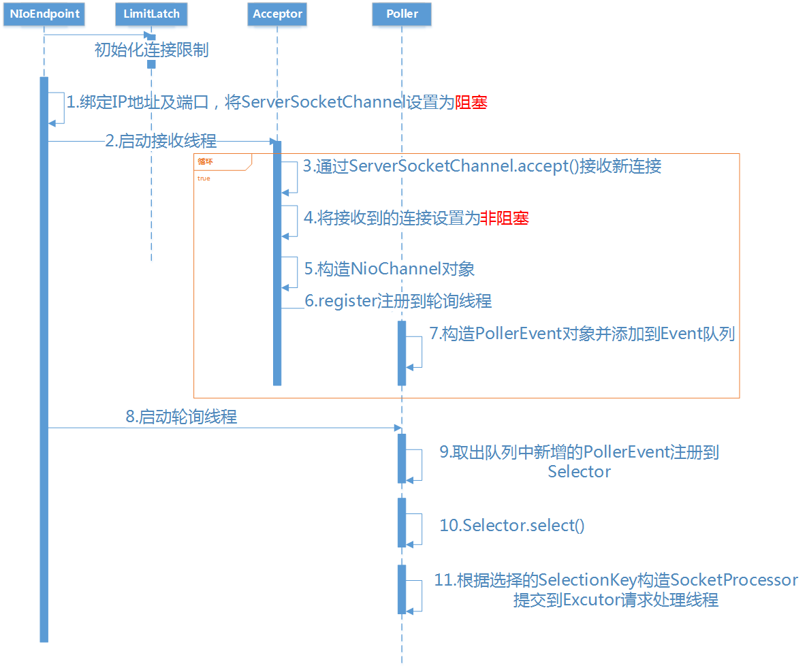

# Tomcat解析

对Tomcat的总结是为了更好得理解`SpringMVC`, 故不会对Tomcat进行全局分析, 将专注于以下四个点:
- Tomcat如何利用Java NIO
- Tomcat对Servlet的实现
- Tomcat的拦截器/过滤器, 设计模式
- SpringBoot对Tomcat的整合


## 1. NioEndPoint
`NioEndPoint`是Tomcat对使用Java NIO来接受请求的实现类

要理解tomcat的nio最主要就是对NioEndpoint的理解。它一共包含`LimitLatch`、`Acceptor`、`Poller`、`SocketProcessor`、`Executor`5个部分。

- `LimitLatch`是连接控制器，它负责维护连接数的计算，nio模式下默认是10000，达到这个阈值后，就会拒绝连接请求。
- `Acceptor`负责接收连接，默认是1个线程来执行，将请求的事件注册到事件列表。
- `Poller`来负责轮询，`Poller`线程数量是cpu的核数`Math.min(2,Runtime.getRuntime().availableProcessors())`。由Poller将就绪的事件生成`SocketProcessor`同时交给`Executor`去执行。
- `Executor`线程池的大小就是我们在Connector节点配置的maxThreads的值。在`Executor`的线程中，会完成从socket中读取http request，解析成`HttpServletRequest`对象，分派到相应的servlet并完成逻辑，然后将response通过socket发回client。


在从socket中读数据和往socket中写数据的过程，并没有像典型的非阻塞的NIO的那样，注册OP_READ或OP_WRITE事件到主Selector，而是直接通过socket完成读写，这时是阻塞完成的，但是在timeout控制上，使用了NIO的Selector机制，但是这个Selector并不是Poller线程维护的主Selector，而是BlockPoller线程中维护的Selector，称之为辅Selector。



下面通过源码来深入理解上图中的内容

### 1.1. NioEndPoint源码解读

从`start()`方法开始

```
org.apache.tomcat.util.net.AbstractEndpoint#start
public final void start() throws Exception {
    if (bindState == BindState.UNBOUND) {
        // 如果没绑定端口,则绑定端口
        bind();
        bindState = BindState.BOUND_ON_START;
    }
    // 初始化Endpoint
    startInternal();
}
```

打开服务器通道, 绑定端口, 打开选择器:
```
private ServerSocketChannel serverSock = null;
// ???
protected SocketProperties socketProperties = new SocketProperties();
// Acceptor线程数
protected int acceptorThreadCount = 1;
// Poller线程数
private int pollerThreadCount = Math.min(2,Runtime.getRuntime().availableProcessors());
// 这个类封装了Selector
private NioSelectorPool selectorPool = new NioSelectorPool();
public void bind() throws Exception {
    // 这里很面熟吧?
    serverSock = ServerSocketChannel.open();
    socketProperties.setProperties(serverSock.socket());
    InetSocketAddress addr = (getAddress()!=null?new InetSocketAddress(getAddress(),getPort()):new InetSocketAddress(getPort()));
    serverSock.socket().bind(addr,getAcceptCount());
    // 默认是阻塞
    serverSock.configureBlocking(true); //mimic APR behavior

    if (acceptorThreadCount == 0) {
        acceptorThreadCount = 1;
    }
    if (pollerThreadCount <= 0) {
        pollerThreadCount = 1;
    }
    setStopLatch(new CountDownLatch(pollerThreadCount));
    // Initialize SSL if needed
    initialiseSsl();
    // 重点 这里调用了Selector.open()
    selectorPool.open();
}

protected static final boolean SHARED = Boolean.parseBoolean(System.getProperty("org.apache.tomcat.util.net.NioSelectorShared", "true"));
public void open() throws IOException {
    enabled = true;
    // 重点
    getSharedSelector();
    // 默认是true
    if (SHARED) {
        blockingSelector = new NioBlockingSelector();
        blockingSelector.open(getSharedSelector());
    }

}

protected volatile Selector SHARED_SELECTOR;
protected Selector getSharedSelector() throws IOException {
    // 又见双重锁定
    if (SHARED && SHARED_SELECTOR == null) {
        synchronized ( NioSelectorPool.class ) {
            if ( SHARED_SELECTOR == null )  {
                // 开启selector
                SHARED_SELECTOR = Selector.open();
            }
        }
    }
    return  SHARED_SELECTOR;
}
```


初始化`NioEndPoint`
```
public void startInternal() throws Exception {
    if (!running) {
        // 如果没启动, 则设置为启动状态
        running = true;
        paused = false;
        // TODO: 这三缓存是?
        processorCache = new SynchronizedStack<>(SynchronizedStack.DEFAULT_SIZE, socketProperties.getProcessorCache());
        eventCache = new SynchronizedStack<>(SynchronizedStack.DEFAULT_SIZE, socketProperties.getEventCache());
        nioChannels = new SynchronizedStack<>(SynchronizedStack.DEFAULT_SIZE, socketProperties.getBufferPool());

        // 初始化线程池, 线程数默认10-200
        if ( getExecutor() == null ) {
            createExecutor();
        }
        // 创建并发连接数控制器
        initializeConnectionLatch();

        // 初始化Poller, 默认2个
        pollers = new Poller[getPollerThreadCount()];
        for (int i=0; i<pollers.length; i++) {
            pollers[i] = new Poller();
            Thread pollerThread = new Thread(pollers[i], getName() + "-ClientPoller-"+i);
            pollerThread.setPriority(threadPriority);
            pollerThread.setDaemon(true);
            pollerThread.start();
        }
        // 初始化接收线程, 默认1个
        startAcceptorThreads();
    }
}
protected LimitLatch initializeConnectionLatch() {
    // maxConnections 最大连接数默认10000
    if (maxConnections==-1) return null;
    if (connectionLimitLatch==null) {
        connectionLimitLatch = new LimitLatch(getMaxConnections());
    }
    return connectionLimitLatch;
}
```

启动`Acceptor`线程后, 重点看下如何接受新请求
```
// true为暂停
protected volatile boolean paused = false;
// Acceptor状态枚举
public enum AcceptorState {
    NEW, RUNNING, PAUSED, ENDED
}
// 默认为新建状态
protected volatile AcceptorState state = AcceptorState.NEW;
private String threadName;
public void run() {
    int errorDelay = 0;
    // Loop until we receive a shutdown command
    while (running) {
        // Loop if endpoint is paused
        while (paused && running) {
            state = AcceptorState.PAUSED;
            try {
                Thread.sleep(50);
            } catch (InterruptedException e) {
                // Ignore
            }
        }

        if (!running) {
            break;
        }
        state = AcceptorState.RUNNING;

        // 检查当前连接数, 如果大于最大连接, wait
        countUpOrAwaitConnection();

        SocketChannel socket = null;
        try {
            //接收新连接
            socket = serverSock.accept();
        } catch (IOException ioe) {
            // 报错, 减少连接数
            countDownConnection();
            if (running) {
                // Introduce delay if necessary
                errorDelay = handleExceptionWithDelay(errorDelay);
                // re-throw
                throw ioe;
            } else {
                break;
            }
        }
        // Successful accept, reset the error delay
        errorDelay = 0;

        // Configure the socket
        if (running && !paused) {
            // setSocketOptions() will hand the socket off to an appropriate processor if successful
            // 重点, 接受到新连接后,注册到轮询线程
            if (!setSocketOptions(socket)) {
                closeSocket(socket);
            }
        } else {
            closeSocket(socket);
        }
    }
    state = AcceptorState.ENDED;
}
protected boolean setSocketOptions(SocketChannel socket) {
    // Process the connection
    try {
        //将连接通道设置为非阻塞
        socket.configureBlocking(false);
        // 缓存socket????
        Socket sock = socket.socket();
        socketProperties.setProperties(sock);

        // 使用NioChannel封装SocketChannel
        NioChannel channel = nioChannels.pop();
        if (channel == null) {
            SocketBufferHandler bufhandler = new SocketBufferHandler(
                    socketProperties.getAppReadBufSize(),
                    socketProperties.getAppWriteBufSize(),
                    socketProperties.getDirectBuffer());
            if (isSSLEnabled()) {
                channel = new SecureNioChannel(socket, bufhandler, selectorPool, this);
            } else {
                channel = new NioChannel(socket, bufhandler);
            }
        } else {
            channel.setIOChannel(socket);
            channel.reset();
        }
        // 重点 获得Poller并调用register()方法
        getPoller0().register(channel);
    } catch (Throwable t) {
        ExceptionUtils.handleThrowable(t);
        // Tell to close the socket
        return false;
    }
    return true;
}
// org.apache.tomcat.util.net.NioEndpoint.Poller#register
public void register(final NioChannel socket) {
    socket.setPoller(this);
    NioSocketWrapper ka = new NioSocketWrapper(socket, NioEndpoint.this);
    socket.setSocketWrapper(ka);
    ka.setPoller(this);
    ka.setReadTimeout(getSocketProperties().getSoTimeout());
    ka.setWriteTimeout(getSocketProperties().getSoTimeout());
    ka.setKeepAliveLeft(NioEndpoint.this.getMaxKeepAliveRequests());
    ka.setSecure(isSSLEnabled());
    ka.setReadTimeout(getConnectionTimeout());
    ka.setWriteTimeout(getConnectionTimeout());
    // 构造PollerEvent，并添加到事件队列
    PollerEvent r = eventCache.pop();
    ka.interestOps(SelectionKey.OP_READ);//this is what OP_REGISTER turns into.
    // 注意, 这里创建的时候使用的是OP_REGISTER, 对应操作是注册到selector
    if ( r==null) r = new PollerEvent(socket,ka,OP_REGISTER);
    else r.reset(socket,ka,OP_REGISTER);
    addEvent(r);
}
private void addEvent(PollerEvent event) {
    events.offer(event);
    if ( wakeupCounter.incrementAndGet() == 0 ) selector.wakeup();
}
```

明显这里使用的是生产/消费模式接受, 那么接下来就是要要那里消费了这个事件

```
public void run() {
    while (true) {
        // 是否有事件
        boolean hasEvents = false;

        try {
            if (!close) {
                // 重点, 检查是否有事件, 在这里把新连接的socketChannel注册到Selector
                hasEvents = events();
                // 注册完socketChannel就调用select阻塞, 知道有数据到达
                if (wakeupCounter.getAndSet(-1) > 0) {
                    //if we are here, means we have other stuff to do  do a non blocking select
                    keyCount = selector.selectNow();
                } else {
                    keyCount = selector.select(selectorTimeout);
                }
                wakeupCounter.set(0);
            }
            if (close) {
                events();
                timeout(0, false);
                try {
                    selector.close();
                } catch (IOException ioe) {
                    log.error(sm.getString("endpoint.nio.selectorCloseFail"), ioe);
                }
                break;
            }
        } catch (Throwable x) {
            ExceptionUtils.handleThrowable(x);
            log.error("",x);
            continue;
        }
        //either we timed out or we woke up, process events first
        if ( keyCount == 0 ) hasEvents = (hasEvents | events());

        Iterator<SelectionKey> iterator =
            keyCount > 0 ? selector.selectedKeys().iterator() : null;
        // Walk through the collection of ready keys and dispatch
        // any active event.
        while (iterator != null && iterator.hasNext()) {
            SelectionKey sk = iterator.next();
            NioSocketWrapper attachment = (NioSocketWrapper)sk.attachment();
            // Attachment may be null if another thread has called
            // cancelledKey()
            if (attachment == null) {
                iterator.remove();
            } else {
                iterator.remove();
                processKey(sk, attachment);
            }
        }//while

        //process timeouts
        timeout(keyCount,hasEvents);
    }//while

    getStopLatch().countDown();
}

public boolean events() {
    boolean result = false;

    PollerEvent pe = null;
    // events.poll()会拉取一个上面插入的PollerEvent
    for (int i = 0, size = events.size(); i < size && (pe = events.poll()) != null; i++ ) {
        result = true;
        try {
            // 重点, 这里是直接调用run方法
            pe.run();
            pe.reset();
            if (running && !paused) {
                eventCache.push(pe);
            }
        } catch ( Throwable x ) {
            log.error("",x);
        }
    }
    return result;
}

public void run() {
    if (interestOps == OP_REGISTER) {
        // 终于, 在这里把新连接的socketChannel注册到Selector
        socket.getIOChannel().register(socket.getPoller().getSelector(), SelectionKey.OP_READ, socketWrapper);
    } else {
        final SelectionKey key = socket.getIOChannel().keyFor(socket.getPoller().getSelector());
        try {
            if (key == null) {
                // The key was cancelled (e.g. due to socket closure)
                // and removed from the selector while it was being
                // processed. Count down the connections at this point
                // since it won't have been counted down when the socket
                // closed.
                socket.socketWrapper.getEndpoint().countDownConnection();
            } else {
                final NioSocketWrapper socketWrapper = (NioSocketWrapper) key.attachment();
                if (socketWrapper != null) {
                    //we are registering the key to start with, reset the fairness counter.
                    int ops = key.interestOps() | interestOps;
                    socketWrapper.interestOps(ops);
                    key.interestOps(ops);
                } else {
                    socket.getPoller().cancelledKey(key);
                }
            }
        } catch (CancelledKeyException ckx) {
            try {
                socket.getPoller().cancelledKey(key);
            } catch (Exception ignore) {}
        }
    }
}
```

## 2. Servlet


## 3. Tomcat的拦截器/过滤器


## 4. SpringBoot与Tomcat的整合

## 5. 附录
    https://www.jianshu.com/p/76ff17bc6dea
    
## 6. TODO