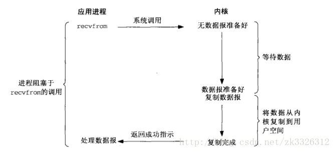
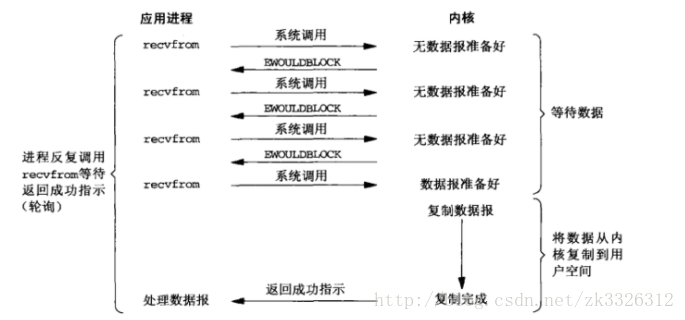
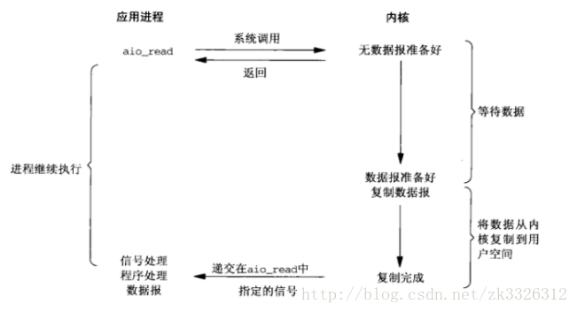

## 简述同步IO、异步IO、阻塞IO、非阻塞IO之间的联系与区别
https://www.cnblogs.com/felixzh/p/10345929.html

一般来说，Linux下系统IO主要就是通过以下几个函数open(),close(),read(),write(),send(),recv(),lseek()，今天就以recv()为例来介绍下IO模型中的同步异步，阻塞非阻塞的区别。

### 一. 阻塞与非阻塞

先说阻塞与非阻塞的区别，recv()函数默认是阻塞的，什么是阻塞呢？就是当你调用recv()函数时，整个进程或者线程就等待在这里了，直到你recv的fd的所有信息都被send过来，这么做好处就是保证所有信息都能够完整的读取了，但劣势也很明显，就是在recv()的过程中你的进程或线程做不了其它事情，由此，引入了非阻塞IO。

非阻塞IO是什么呢，还是以recv()函数为例，当你将其设置为非阻塞时，每次当你recv()时，就直接返回，不管信息有没有完全send进来，好处很明显，recv()了之后进程马上能处理下一行代码，坏处也很明显，就是你不知道你的消息是否读完了，这种问题就是TCP中大名鼎鼎的半包问题（解决办法主要是通过一个buffer缓存所有读进来的消息）

打一个比方，你要去开水房接水，在阻塞情况下，你需要等待你的杯子接满，你才可以离开，很多时候水还没来，你就浪费了很多时间，因为在没水的这段时间你不能做其它事情，好处就是可以直接接满水.

在非阻塞情况下，你每次接水就接一些，只要没水了你就可以离开去做其它的事情，但需要你自己去看好量是不是接满了。阻塞和非阻塞的I/O模型图示如下：

阻塞IO模型：

非阻塞IO模型：

### 二. 同步与异步

在POSIX(可移植操作系统接口)定义中把同步IO操作定义为导致进程阻塞直到IO完成的操作，反之则是异步IO，看概念感觉异步跟非阻塞好像也没有什么区别，要好好理解同步和异步，就要详细说明下IO过程：

IO过程主要分两步：

1.数据准备阶段

2.内核空间复制回用户进程缓冲区空间

无论阻塞式IO还是非阻塞式IO，都是同步IO模型，区别就在与第一步是否完成后才返回，但第二步都需要当前进程去完成，异步IO呢，就是从第一步开始就返回，直到第二步完成后才会返回一个消息，也就是说，非阻塞能够让你在第一步时去做其它的事情，而真正的异步IO能让你第二步的过程也能去做其它事情。这里就在说一下select,poll和epoll这几个IO复用方式，这时你就会了解它们为什么是同步IO了，以epoll为例，在epoll开发的服务器模型中，epoll_wait()这个函数会阻塞等待就绪的fd，将就绪的fd拷贝到epoll_events集合这个过程中也不能做其它事（虽然这段时间很短，所以epoll配合非阻塞IO是很高效也是很普遍的服务器开发模式--同步非阻塞IO模型）。有人把epoll这种方式叫做同步非阻塞（NIO），因为用户线程需要不停地轮询，自己读取数据，看上去好像只有一个线程在做事情，也有人把这种方式叫做异步非阻塞（AIO），因为毕竟是内核线程负责扫描fd列表，并填充事件链表的，个人认为真正理想的异步非阻塞，应该是内核线程填充事件链表后，主动通知用户线程，或者调用应用程序事先注册的回调函数来处理数据，如果还需要用户线程不停的轮询来获取事件信息，就不是太完美了，所以也有不少人认为epoll是伪AIO，还是有道理的。

再生动一点，还是以接水为例，当你使用epoll的IO复用时，相当于接水方有了一个服务员，他会告诉你哪些水龙头有水可以接，然后你可以阻塞或者非阻塞（最好是非阻塞，不然epoll的意义就不大了）的去接水，但接水这个过程，还是要你自己完成。而异步的IO模型呢，相当于你去水房，直接把水杯递给服务员，让他给你接好后再通知你来，连接水的过程也不需要了.

异步IO的模型如下图：

### 三. IO复用模型

这里在调用recv前先调用select或者poll，这2个系统调用都可以在内核准备好数据(网络数据到达内核)时告知用户进程，这个时候再调用recv一定是有数据的。因此这一过程中它是阻塞于select或poll，而没有阻塞于recv，有人将非阻塞IO定义成在读写操作时没有阻塞于系统调用的IO操作(不包括数据从内核复制到用户空间时的阻塞，因为这相对于网络IO来说确实很短暂)，如果按这样理解，这种IO模型也能称之为非阻塞IO模型，但是按POSIX来看，它也是同步IO，那么也和楼上一样称之为同步非阻塞IO吧。

这种IO模型比较特别，分个段。因为它能同时监听多个文件描述符(fd)。这个时候C同学来装水，发现有一排水龙头，舍管阿姨告诉他这些水龙头都还没有水，等有水了告诉他。于是等啊等(select调用中)，过了一会阿姨告诉他有水了，但不知道是哪个水龙头有水，自己看吧。于是C同学一个个打开，往杯子里装水(recv)。这里再顺便说说鼎鼎大名的epoll(高性能的代名词啊)，epoll也属于IO复用模型，主要区别在于舍管阿姨会告诉C同学哪几个水龙头有水了，不需要一个个打开看(当然还有其它区别)。

### 四. 总结

*信号驱动io模型貌似在java里没有实现

