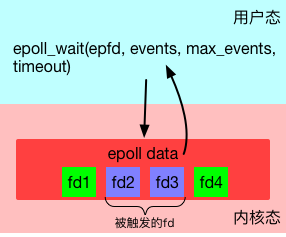
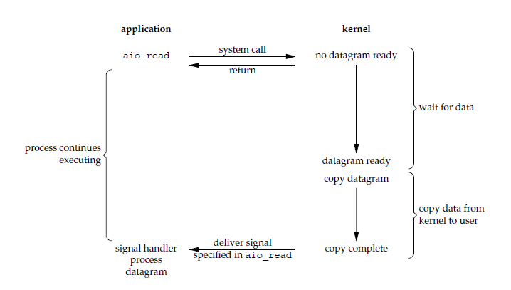

# IO概念及源码分析

IO模型大体分为:
- BIO 阻塞IO模型
- NIO 非阻塞IO模型
- AIO 异步IO模型

其中有一个概念需要提前清楚, 就是`文件描述符`. 

`文件描述符（File descriptor, 简称fd）`是计算机科学中的一个术语，是一个用于表述指向文件的引用的抽象化概念。

文件描述符在形式上是一个非负整数。实际上，它是一个索引值，指向内核为每一个进程所维护的该进程打开文件的记录表。当程序打开一个现有文件或者创建一个新文件时，内核向进程返回一个文件描述符。

在程序设计中，一些涉及底层的程序编写往往会围绕着文件描述符展开。但是文件描述符这一概念往往只适用于UNIX、Linux这样的操作系统。

我们可以通过文件描述符拿到到达的数据.

## 1. I/O 模型
   
一个输入操作通常包括两个阶段：

- 等待数据准备好
- 从内核向进程复制数据

对于一个套接字上的输入操作，第一步通常涉及等待数据从网络中到达。当所等待数据到达时，它被复制到内核中的某个缓冲区。第二步就是把数据从内核缓冲区复制到应用进程缓冲区。

Unix 在引入`I/O 复用`和`信号驱动式`的概念后, 一共有五种 I/O 模型：

- 阻塞I/O
- 非阻塞I/O
- I/O多路复用（select 和 poll）
- 信号驱动式 I/O（SIGIO）
- 异步 I/O（AIO）

## 2. 阻塞IO

应用进程被阻塞，直到数据从内核缓冲区复制到应用进程缓冲区中才返回。

举个例子，当用`recvfrom()`去读取网络的数据时，是无法预知对方是否已经发送数据的。因此在收到数据之前，能做的只有等待，直到对方把数据发过来，或者等到网络超时。

下图中，`recvfrom()` 用于接收 Socket 传来的数据，并复制到应用进程的缓冲区`buf`中。这里把`recvfrom()`当成系统调用。


对于单线程的网络服务，这样做就会有卡死的问题。因为当等待时，整个线程会被挂起，无法执行，也无法做其他的工作。

    顺便说一句，这种Block是不会影响同时运行的其他程序（进程）的，因为现代操作系统都是多任务的，任务之间的切换是抢占式的。这里Block只是指Block当前的进程。

于是，网络服务为了同时响应多个并发的网络请求，必须实现为多线程的。每个线程处理一个网络请求。线程数随着并发连接数线性增长。这的确能奏效。实际上2000年之前很多网络服务器就是这么实现的。但这带来两个问题：

- 线程越多，Context Switch就越多，而Context Switch是一个比较重的操作，会无谓浪费大量的CPU。
- 每个线程会占用一定的内存作为线程的栈。比如有1000个线程同时运行，每个占用1MB内存，就占用了1个G的内存。尽管现在通过使用大内存，可以轻易实现并发1万甚至10万的连接。但是水涨船高，如果是要单机撑1千万的连接呢？

问题的关键在于，当调用read接受网络请求时，有数据到了就用，没数据到时，实际上是可以干别的。使用大量线程，仅仅是因为Block发生，没有其他办法。

当然你可能会说，是不是可以弄个线程池呢？这样既能并发的处理请求，又不会产生大量线程。但这样会限制最大并发的连接数。比如你弄4个线程，那么最大4个线程都Block了就没法响应更多请求了。

要是操作IO接口时，操作系统能够总是直接告诉有没有数据，而不是Block去等就好了。于是，NIO登场。


## 3. 非阻塞I/O

`非阻塞I/O`与`阻塞IO`的区别就是,  `非阻塞I/O`调用`recvfrom()`，如果发现没数据已经到达，就会立刻返回-1, 而`阻塞I/O`调用会被阻塞

所以, `非阻塞I/O`就可以设计成不断地调用`recvfrom()`直到数据到达, 这种方式称为轮询（polling）。


但这样会带来两个新问题：

    如果有大量文件描述符都要等，那么就得一个一个的read。这会带来大量的Context Switch（read是系统调用，每调用一次就得在用户态和核心态切换一次）
    休息一会的时间不好把握。这里是要猜多久之后数据才能到。等待时间设的太长，程序响应延迟就过大；设的太短，就会造成过于频繁的重试，干耗CPU而已。

要是操作系统能一口气告诉程序，哪些数据到了就好了。

于是IO多路复用被搞出来解决这个问题。

## 4. IO多路复用

IO多路复用（IO Multiplexing) 是这么一种机制：程序注册一组socket文件描述符给操作系统，表示“我要监视这些fd是否有IO事件发生，有了就告诉程序处理”。

IO多路复用是要和NIO一起使用的。尽管在操作系统级别，NIO和IO多路复用是两个相对独立的事情。NIO仅仅是指IO API总是能立刻返回，不会被Blocking；而IO多路复用仅仅是操作系统提供的一种便利的通知机制。

操作系统并不会强制这俩必须得一起用. 你可以用NIO，但不用IO多路复用；也可以只用IO多路复用 + BIO，这时效果还是当前线程被卡住。

    当使用BIO+多路复用时, `select()`方法会返回所有的文件描述符, 这时候调用`recvfrom()`的话极有可能会被阻塞, 所以使用BIO+多路复用毫无意义
    当使用BIO+多路复用时, `select()`方法会返回所有的文件描述符, 这时候调用`recvfrom()`的话可能返回-1或已经到达的数据, 如果是-1则遍历下一个文件描述符, 如果是到达的数据则处理数据

所以，**IO多路复用和NIO是要配合一起使用才有实际意义。**


特点: 
- IO多路复用说的是多个Socket，只不过操作系统是一起监听他们的事件而已。
- IO多路复用的关键API调用`select，poll，epoll_wait`总是Block的
- IO本身（网络数据的收发）无论用不用IO多路复用和NIO，都没有变化。请求的数据该是多少还是多少；网络上该传输多少数据还是多少数据。IO多路复用和NIO一起仅仅是解决了调度的问题，避免CPU在这个过程中的浪费，使系统的瓶颈更容易触达到网络带宽，而非CPU或者内存。

### 4.1. select和poll

操作系统级别提供了一些接口来支持IO多路复用，最老掉牙的是select和poll。

select 允许应用程序监视一组文件描述符，等待一个或者多个描述符成为就绪状态，从而完成 I/O 操作。

poll优化了select的一些问题。比如不再有3个数组，而是1个polldfd结构的数组了，并且也不需要每次重设了。数组的个数也没有了1024的限制。但其他的问题依旧：

    依然是无状态的，性能的问题与select差不多一样；
    应用程序仍然无法很方便的拿到那些“有事件发生的fd“，还是需要遍历所有注册的fd。

目前来看，高性能的web服务器都不会使用select和poll。他们俩存在的意义仅仅是“兼容性”，因为很多操作系统都实现了这两个系统调用。

这里仅简单介绍下`select`和`poll`, 其详情请看附录中的文章


## 5. 信号驱动I/O

应用进程使用 sigaction 系统调用，内核立即返回，应用进程可以继续执行，也就是说等待数据阶段应用进程是非阻塞的。内核在数据到达时向应用进程发送 SIGIO 信号，应用进程收到之后在信号处理程序中调用 recvfrom 将数据从内核复制到应用进程中。

`信号驱动I/O`与`IO多路复用`的区别我并没在网上找到, 就我个人理解, 他们俩从概念上说,最大区别是`IO多路复用`返回所有监视的fd, 而`信号驱动I/O`精确地返回有数据到达的fd, 其他并无多大区别, `信号驱动I/O`是`IO多路复用`的一个子类

在我看来, `Java NIO`模型毫无疑问是信号驱动的一种实现


## 6. epoll

对linux系统而言, `epoll`是`信号驱动I/O`的实现

`epoll`及其重要, 所以独立出来说

### 6.1. 创建epoll
要使用`epoll`是需要先创建一下的。
```c
int epoll_create(int size);
```
`epoll_create`在内核层创建了一个数据表，接口会返回一个“epoll的文件描述符”指向这个表。注意，接口参数是一个表达要监听事件列表的长度的数值, 内部会自动调整.

### 6.2. 注册事件
epoll创建后，第二步是使用`epoll_ctl`接口来注册要监听的事件。
```c
int epoll_ctl(int epfd, int op, int fd, struct epoll_event *event);
```
其中第一个参数就是上面创建的epfd。第二个参数op表示如何对文件名进行操作，共有3种。
- `EPOLL_CTL_ADD` - 注册一个事件
- `EPOLL_CTL_DEL` - 取消一个事件的注册
- `EPOLL_CTL_MOD` - 修改一个事件的注册

第三个参数是要操作的fd，这里必须是支持NIO的fd（比如socket）。

第四个参数是一个`epoll_event`的类型的数据，表达了注册的事件的具体信息。如`读事件`, `写事件`,`连接事件`, `水平触发`, `边沿触发`

### 6.3. 等待事件发生
第三步，使用`epoll_wait`来等待事件的发生。
```c
int epoll_wait(int epfd, struct epoll_event *evlist, int maxevents, int timeout);
```
特别留意，这一步是"block"的。只有当注册的事件至少有一个发生，或者timeout达到时，该调用才会返回。这与select和poll几乎一致。但不一样的地方是evlist，它是epoll_wait的返回数组，里面只包含那些被触发的事件对应的fd，而不是像select和poll那样返回所有注册的fd。




### 6.4. epoll的优势
    
为什么epoll的性能比select和poll要强呢？ select和poll每次都需要把完成的fd列表传入到内核，迫使内核每次必须从头扫描到尾。而epoll完全是反过来的。epoll在内核的数据被建立好了之后，每次某个被监听的fd一旦有事件发生，内核就直接标记之。epoll_wait调用时，会尝试直接读取到当时已经标记好的fd列表，如果没有就会进入等待状态。

同时，epoll_wait直接只返回了被触发的fd列表，这样上层应用写起来也轻松愉快，再也不用从大量注册的fd中筛选出有事件的fd了。

简单说就是select和poll的代价是"O(所有注册事件fd的数量)"，而epoll的代价是"O(发生事件fd的数量)"。于是，高性能网络服务器的场景特别适合用epoll来实现——因为大多数网络服务器都有这样的模式：同时要监听大量（几千，几万，几十万甚至更多）的网络连接，但是短时间内发生的事件非常少。

但是，假设发生事件的fd的数量接近所有注册事件fd的数量，那么epoll的优势就没有了，其性能表现会和poll和select差不多。

epoll除了性能优势，还有一个优点——同时支持水平触发(Level Trigger)和边沿触发(Edge Trigger)。

### 6.5. 水平触发和边沿触发

默认情况下，epoll使用水平触发，这与select和poll的行为完全一致。在水平触发下，epoll顶多算是一个“跑得更快的poll”。

而一旦在注册事件时使用了`EPOLLET`标记（`epoll_ctl`方法中的`event`参数），那么将其视为边沿触发（或者有地方叫边缘触发，一个意思）。那么到底什么是水平触发和边沿触发呢？

考虑下图中的例子。有两个socket的fd——fd1和fd2。我们设定监听fd1的“水平触发读事件“，监听fd2的”边沿触发读事件“。我们使用在时刻t1，使用`epoll_wait`监听他们的事件。在时刻t2时，两个fd都到了100bytes数据，于是在时刻t3, `epoll_wait`返回了两个fd进行处理。在t4，我们故意不读取所有的数据出来，只各自读50bytes。然后在t5重新注册两个事件并监听。在t6时，只有fd1会返回，因为fd1里的数据没有读完，仍然处于“被触发”状态；而fd2不会被返回，因为没有新数据到达。


## 7. 异步IO

AIO在概念上却很简单，意思是通过一个回调处理数据。比如在nodejs中，读取文件的用法可以非常清晰的反映出什么才是AIO。

```
const fs = require('fs'); // 引入fs这个包
fs.read('/path/to/file', function(data) {
    // 处理文件的数据
    console.log('文件数据处理完成');
});
console.log('开始读取文件');
```


程序员可以指定要读取一个文件，并且指定当读取完成后要处理的函数。这个指定立刻执行，不会等待文件的读取。这个模式可以清晰的反映出我们脑海中那个理想的AIO的样子。

但是现实是很悲催的，因为操作系统层面的AIO没法变成理想中的样子。
- 操作系统的AIO接口只支持文件操作。对于网络，需要用epoll这样的IO多路复用技术。如果要统一网络和磁盘IO都可以AIO就必须在上层进行封装，屏蔽掉操作系统这么不一致的细节（比如libuv就是这么干的）。
- 由于系统调用并不只直接支持”回调”（“信号”在工程上难以应用于IO回调这个场景，不算数），程序员需要自行使用io_getevents这样的API来主动等事件。在操作系统层面上，能做的最舒服的就是统一用epoll_wait做这个“等事件”的核心。这时需要借助eventfd。POSIX AIO并不支持eventfd，所以虽然有这么套接口，但是一般没机会用。
- Linux AIO只支持Direct IO，所以无法利用Page Cache。所以现实当中，用不用是要做取舍的（nginx有一个选项aio就是配置这个功能的，见这里)。
- Linux AIO不能100%实现所有文件操作api都能“异步”。

所以在操作系统上这个级别上，AIO非常的“别扭”。

基于以上的这些问题，一般上层（nodejs，Java NIO）都会选择用**线程池+BIO来模拟文件AIO**。好处是：
- BIO这一套接口非常完备，文件IO除了read，write，还有stat，fsync，rename等接口在现实中也是经常需要“异步”的；
- 编程容易。看看上面的例子，是不是非常容易晕。而这些已经是非常简化的例子了，现实中的代码要处理相当多的细节；
- 不用在AIO和Buffered IO中做取舍。BIO天然可以利用Page Cache来提高性能；
- 容易跨平台。不同操作系统的线程实现和BIO的实现基本上完备一致，不会像AIO那样细节差异相当巨大。

## 8. 总结


## 9. 附录
- https://www.cnblogs.com/felixzh/p/10345929.html
- https://github.com/CyC2018/CS-Notes.git
- https://www.jianshu.com/p/444646e02ef7
- https://www.jianshu.com/p/ef418ccf2f7d
- https://www.jianshu.com/p/fe54ca4affe8