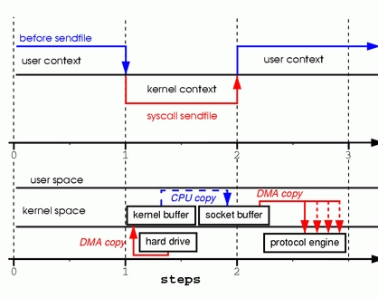

# 零拷贝

零拷贝实际的实现并没有真正的标准，取决于操作系统如何实现这一点。零拷贝完全依赖于操作系统。操作系统支持，就有；不支持，就没有。不依赖Java本身。

## IO读写的方式

### 中断


- 用户进程发起数据读取请求
- 系统调度为该进程分配cpu
- cpu向io控制器(ide,scsi)发送io请求
- 用户进程等待io完成，让出cpu
- 系统调度cpu执行其他任务
- 数据写入至io控制器的缓冲寄存器
- 缓冲寄存器满了向cpu发出中断信号
- cpu读取数据至内存

中断次数取决于缓冲寄存器的大小, CPU需要多次中断才能将数据读取至内存

### DMA ： 直接内存存取


- 用户进程发起数据读取请求
- 系统调度为该进程分配cpu
- cpu向DMA发送io请求
- 用户进程等待io完成，让出cpu
- 系统调度cpu执行其他任务
- 数据写入至io控制器的缓冲寄存器
- DMA不断获取缓冲寄存器中的数据（需要cpu时钟）
- 传输至内存（需要cpu时钟）
- 所需的全部数据获取完毕后向cpu发出中断信号

CPU只需一次中断, 现代操作系统都是用这种方式

## 传统数据拷贝


两张图一个意思

read(file, tmp_buf, len);write(socket, tmp_buf, len);
- 调用read(),上下文切换到内核，DMA把磁盘数据复制到内核的缓存空间
- read()返回，上下文切换到用户进程，CPU把数据复制到用户的缓存空间
- write() 上下文切换到内核，CPU把数据复制到内核socket缓存,write返回，上下文切换的进程
- DMP把socket缓存数据复制到网卡缓存上

经过4次上下文切换，4次数据拷贝

## 零拷贝的实现

### mmap

对应Java实现:
```
FileInputStream inputStream = new FileInputStream(file);
FileChannel channel = inputStream.getChannel();
MappedByteBuffer map = channel.map(MapMode.READ_WRITE, 0, file.length());
```


- mmap系统调用导致DMA引擎将文件内容复制到内核缓冲区中。然后与用户进程共享缓冲区，而不在内核和用户存储器空间之间执行任何复制。

- write系统调用导致内核将数据从原始内核缓冲区复制到与套接字相关联的内核缓冲区中。

- 当DMA引擎将数据从内核套接字缓冲区传递到协议引擎时，发生第三次复制。

它与传统I/O相比仅仅少了1次内核空间缓冲区和用户空间缓冲区之间的CPU拷贝。

这样的好处是，我们可以将整个文件或者整个文件的一部分映射到内存当中，用户直接对内存中对文件进行操作，然后是由操作系统来进行相关的页面请求并将内存的修改写入到文件当中。

我们的应用程序只需要处理内存的数据，这样可以实现非常迅速的I/O操作。

### sendfile

对应Java实现:
```
//将数据从文件通道传输到了给定的可写字节通道
FileChannel.transferTo(long position, long count, WritableByteChannel target)
```



- sendfile系统调用导致文件内容被DMA引擎复制到内核缓冲区中。 然后内核将数据复制到与套接字相关联的内核缓冲区中。

- 当DMA引擎将数据从内核套接字缓冲区传递到协议引擎时，发生第三次复制。

到目前为止，我们已经能够避免一些内核复制操作，但是我们仍然有一次内核复制操作。 这也可以避免吗？ 当然，这需要硬件的一点帮助。 


- sendfile系统调用导致文件内容被DMA引擎复制到内核缓冲区中。

- 没有数据被复制到套接字缓冲区。相反，只有关于数据的位置和长度的信息的描述符附加到套接字缓冲区。 DMA引擎将数据直接从内核缓冲区传递到协议引擎，从而消除最后剩下的一次内存拷贝。

因为数据实际上仍然是从磁盘复制到内存和从内存到电线，

当使用零拷贝时，除了避免拷贝之外，还可以有其他性能优势，例如较少的上下文切换，较少的CPU缓存数据污染和没有CPU计算校验和的操作。


## 附录
    https://blog.csdn.net/u013018618/article/details/80146617
    https://www.cnblogs.com/yibutian/p/9482640.html
    https://leokongwq.github.io/2017/01/12/linux-zero-copy.html
    https://www.linuxjournal.com/article/6345?page=0,1
    https://www.jianshu.com/p/220ccfc91e95      重要